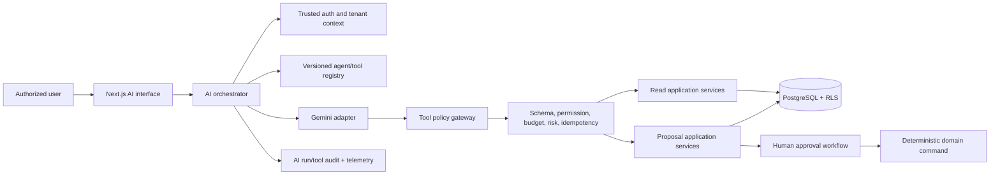
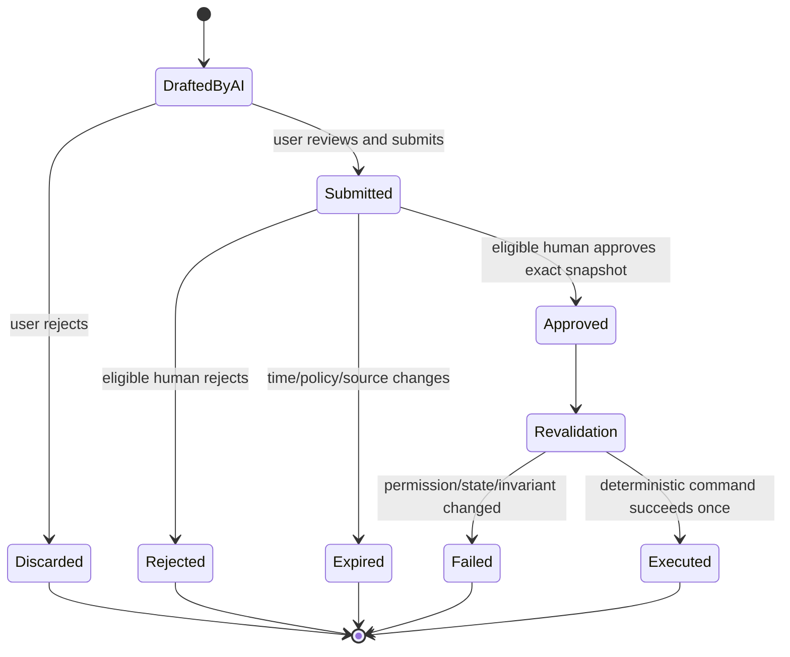

# Voya OS AI Agents

**Status:** Policy and Agent Center foundation implemented; Gemini adapter is bounded and disabled by default
**Provider:** Gemini through a server-side adapter; Preview/test use a deterministic fake provider
**Autonomy:** bounded assistance and proposal creation; no direct booking or financial source-of-record mutations

## 1. AI policy

AI is an optional assistance layer, never the system of record. A model may interpret a request, summarize authorized facts, choose from allowlisted tools, and draft a proposed action. Deterministic application services validate and execute tools under the initiating user's permissions.

Hard rules:

- No model, prompt, or AI runtime receives database credentials, Supabase service-role credentials, provider secrets, arbitrary SQL, arbitrary HTTP, filesystem, or code-execution tools.
- The authenticated user, membership, organization, permissions, locale, and session assurance come from trusted server context, never model arguments.
- AI cannot directly create, confirm, amend, cancel, or delete booking source records.
- AI cannot directly create, post, reconcile, reverse, refund, delete, or settle financial source records.
- AI cannot approve proposals, change roles/policies, export bulk sensitive data, or bypass a domain/database constraint.
- Booking and finance changes are explicit proposals reviewed by a human; the eventual command is independently reauthorized, revalidated, idempotent, and audited.
- Core workflows remain usable when AI is disabled, unsafe, slow, over budget, or unavailable.

## 2. Initial agents

The term “agent” means a bounded orchestration profile with its own instructions, tool allowlist, budget, eval suite, and feature flag. It does not imply an open-ended autonomous loop.

| Agent | Primary users/job | Permitted outcomes | Prohibited outcomes |
|---|---|---|---|
| Sales agent | Sales/manager: qualify leads, match preferences, draft follow-ups | Tenant-scoped lead/client/property reads; availability query; suggested matches; draft messages; optionally append a labeled CRM note through a controlled tool | Booking mutation; financial figures outside permission; bulk export; sending external messages without a separately approved workflow |
| Booking agent | Sales/operations/manager: assemble a booking proposal and explain conflicts | Read client/property/availability/policy; validate draft inputs; create a booking **proposal/approval request**; summarize status | Create/confirm/amend/cancel booking records; reserve inventory; override blocks/conflicts; invent price/cancellation rules |
| Finance agent | Accountant/authorized owner: find exceptions and prepare finance work | Read authorized finance/booking facts; explain provenance; flag duplicates/anomalies; create reconciliation, adjustment, commission, expense, or settlement **proposals** | Post/reconcile/reverse/refund/delete/finalize; calculate from undefined rules; combine currencies without approved policy; initiate payouts |
| Manager agent | Owner/manager: summarize operations and surface decisions | Aggregated authorized insights, approval-queue summary, risks, suggested follow-ups, deep links to source facts | Approve/execute actions; reveal restricted fields; rank employees using sensitive/inferred traits; silently treat model output as KPI truth |

Role names and AI agent names must be visually distinct in the product (for example, “Sales AI assistant” versus the `sales_agent` role).

## 3. Recommended pattern

Use a hybrid of a bounded Responses API call, retrieval through structured tenant-scoped tools, and controlled function calling. Do not add general RAG/vector storage initially: operational facts change rapidly and should be retrieved from authoritative queries. Add document retrieval only for an approved knowledge corpus with tenant metadata filters, citations, retention, and prompt-injection controls.



## 4. Runtime contract

### Request

- authenticated user/membership and active organization from server session;
- agent ID/version, locale, user message, conversation/run ID;
- optional resource references that are independently resolved and authorized;
- cancellation/deadline and user-visible purpose.

### Response

- localized answer with clear AI labeling;
- structured citations to Voya OS records the user is allowed to open, where factual claims depend on them;
- optional proposal containing type, human-readable effect, assumptions/warnings, exact normalized payload, source versions, expiry, and proposal ID;
- status/error category: complete, needs clarification, approval required, denied, safety refused, provider unavailable, timed out, or budget exceeded.

### Tool envelope

Every tool has a versioned JSON schema and metadata:

```text
name/version, purpose, risk class, read/write/proposal effect,
allowed agent IDs, required capabilities, field redaction policy,
maximum rows/date range, timeout, idempotency behavior,
approval behavior, audit event type, and response schema.
```

Tool handlers reject unknown properties, resolve resource IDs inside the trusted organization, apply field policy, return bounded/minimized results, and use stable domain error codes. The model never supplies trusted actor/tenant/approval status.

## 5. Initial tool registry

| Tool | Effect | Agent allowlist | Required control |
|---|---|---|---|
| `search_properties_v1` | Read | sales, booking, manager | Tenant filters, bounded results, authorized fields |
| `check_availability_v1` | Read advisory availability | sales, booking, manager | Date/property validation; clearly not a reservation |
| `get_lead_or_client_v1` | Read | sales, booking, manager | Assignment/field policy and PII minimization |
| `append_crm_note_v1` | Non-critical write, disabled by default | sales | Explicit preview/confirm, labeled AI provenance, idempotency, audit |
| `create_booking_proposal_v1` | Proposal only | sales, booking, manager | No booking row mutation; snapshot/version; approval route |
| `get_booking_summary_v1` | Read | booking, finance, manager | Field policy and source links |
| `get_finance_exceptions_v1` | Read | finance, manager | Finance capability, bounded period, no sensitive provider data |
| `create_finance_proposal_v1` | Proposal only | finance | Approved proposal types/rules only; provenance and evidence |
| `create_settlement_proposal_v1` | Proposal only | finance | Snapshot sources/currency/rule version; block on unresolved policy |
| `get_approval_queue_summary_v1` | Read | manager | Only decisions user may view; no decision tool |
| `get_operational_summary_v1` | Read | manager | Aggregated authorized queries; source freshness and links |

There is intentionally no `confirm_booking`, `cancel_booking`, `post_payment`, `refund_payment`, `post_expense`, `post_commission`, `finalize_settlement`, `approve`, `execute_sql`, `fetch_url`, or `export_all` AI tool.

## 6. Human approval boundary



The UI must show source facts, calculated fields with rule/version, unknown assumptions, proposed database/business effect, and approval path. “Approve” is never a model-generated tool call. A human click alone is also insufficient: the server consumes an eligible approval only after current checks pass.

## 7. Prompt and data security

- Treat user content, CRM notes, documents, tool results, and retrieved text as untrusted data, never instructions.
- Keep system/developer policy separate from data delimiters; instruct the model to ignore embedded attempts to change tools, tenant, rules, or secrecy.
- Prefer structured authoritative tools to large record dumps; minimize fields and rows before provider transmission.
- Redact or tokenize PII where the job allows. Do not send government IDs, bank credentials, payment credentials, auth tokens, secrets, or unrelated contact data.
- Confirm Gemini data processing, retention, residency, and contractual settings against launch jurisdictions before production. A Free Tier configuration must never receive real customer data.
- Validate all model JSON. Escape model text in UI, never execute returned markup/code, and prevent model-created URLs from becoming server-side fetches.
- Apply per-user/tenant rate limits, concurrent-run limits, token/tool/step/time budgets, anomaly detection, and a global/per-agent kill switch.
- Do not place full prompts, raw sensitive tool results, or secrets in ordinary logs. Store a redacted evaluation trace with access/retention policy.
- Pin model behavior through a configurable model alias/version policy and rerun evals before model, prompt, tool, or policy promotion.

## 8. Failure and fallback behavior

| Failure | Behavior |
|---|---|
| Provider timeout/outage | Stop the run, show localized retry/manual path, record classified telemetry; no critical workflow is blocked |
| Invalid/refused model output | One bounded repair attempt only when safe, otherwise fail closed |
| Tool denied/not found | Do not reveal resource existence; return a safe limitation and audit the denial |
| Stale proposal/source version | Supersede/expire proposal and ask user to regenerate/review |
| Tool succeeded but model continuation failed | Preserve tool result/proposal idempotently; show status via run lookup; never repeat mutation blindly |
| Budget/step exceeded | Terminate deterministically and retain safe partial draft only if useful |
| Prompt injection detected | Block affected tool path, disclose that content could not be trusted, record security signal |
| Cross-tenant reference | Deny generically, emit high-priority security telemetry, reveal no target data |
| Undefined financial/booking rule | State the missing decision and route to human policy owner; do not calculate or execute |

## 9. Evaluation plan

Maintain versioned, de-identified/synthetic Arabic and English datasets by agent and tool version.

### Evaluation dimensions

- task completion and factual accuracy against authoritative fixtures;
- citation/source correctness and freshness;
- JSON/tool schema validity and correct tool selection;
- tenant, role, assignment, and field-policy compliance;
- refusal of direct booking/financial mutations and undefined rules;
- prompt-injection resistance and sensitive-data minimization;
- proposal completeness, provenance, and human edit rate;
- Arabic quality, RTL-safe content, English parity, and hallucinated translation risk;
- latency, input/output tokens, tool count, provider errors, and cost per successful task.

### Mandatory launch gates

- Zero successful cross-tenant/unauthorized disclosures in the adversarial release suite.
- Zero direct booking/financial source-record mutations from any AI tool path.
- Zero successful self-approval, policy bypass, arbitrary SQL/HTTP, secret retrieval, or unbounded-loop cases.
- 100% valid schema for any proposal accepted by the backend; invalid output never reaches a domain command.
- Product owners define agent-specific quality, latency, cost, refusal, and Arabic-language thresholds before rollout.

Run offline evals on every prompt/tool/model/policy change; run integration tests against fake provider responses; canary production with shadow/read-only modes and human feedback. Production samples used for eval require privacy-approved collection and redaction.

## 10. Observability and cost

Record per run: tenant/user pseudonymous references, agent/model/prompt/tool versions, timestamps, latency, token/cost estimates, tool outcome/error classes, safety/permission decisions, proposal/approval IDs, user acceptance/edit/discard, and correlation ID. Do not record disallowed content merely for observability.

Dashboards/alerts:

- cost and tokens by tenant/agent/version, daily/weekly budgets and anomaly spikes;
- p50/p95 latency, provider error/timeout, tool error, repair and cancellation rates;
- permission denials, cross-tenant attempts, injection signals, sensitive-data filter blocks;
- proposal acceptance/edit/rejection, stale proposal, downstream execution failure;
- eval regression and model/prompt/tool version drift.

## 11. Rollout

1. Build provider adapter, policy gateway, audit schema, fake model, and eval harness with no production agent enabled.
2. Enable read-only sales summaries for internal test organizations using synthetic/non-sensitive data.
3. Canary the sales agent with strict budgets, source links, feedback, and kill switch.
4. Add booking proposal creation; keep confirmation/cancellation manual and deterministic.
5. Add finance read-only exception detection, then proposal creation only after finance policies and evals are approved.
6. Add manager aggregation after field-level/reporting permissions are validated.
7. Expand tenants gradually; compare business outcomes and safety signals; rollback by agent/tool/prompt/model feature flags.

## 12. Open decisions

- Gemini model aliases (the project default is `gemini-3.1-flash-lite`; explicit environment overrides remain supported), regional/data-processing configuration, retention, cost and latency budgets.
- Conversation retention, user-visible history, deletion/export, and whether production traces may seed evals.
- Which non-critical CRM writes are allowed and whether external message sending is in scope.
- Source/citation UX and whether a curated knowledge-base/RAG layer is needed.
- Language-quality owner and approved Arabic terminology/style guide.
- Human-review staffing, escalation SLAs, AI incident ownership, and customer opt-out controls.
- Agent-specific quality thresholds and measurable business KPIs.
