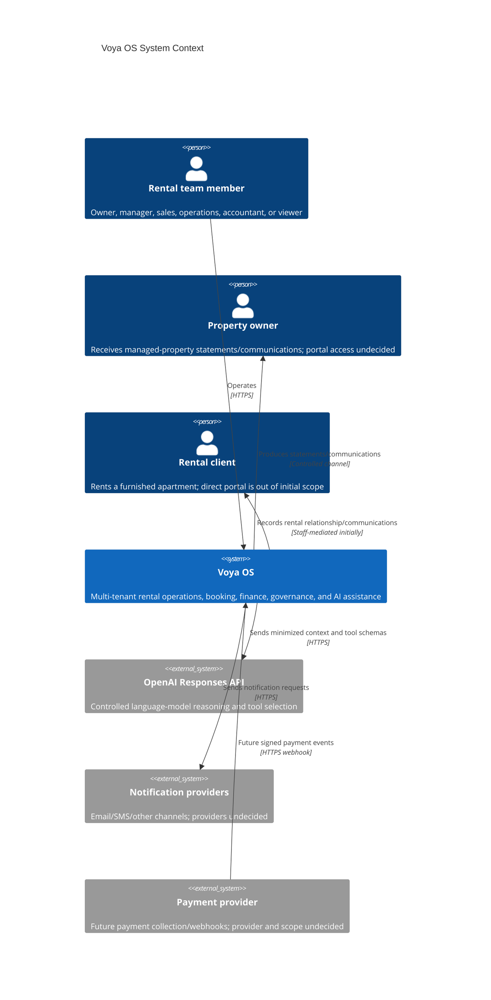
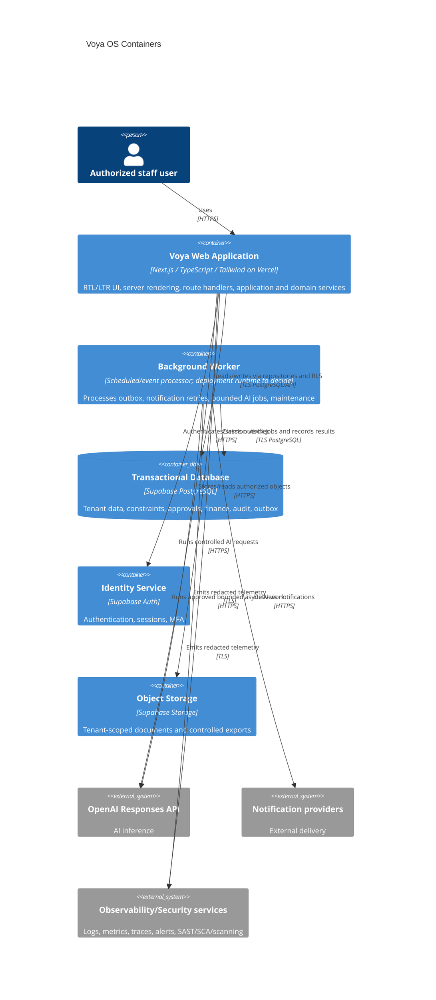
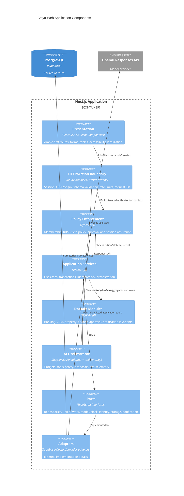
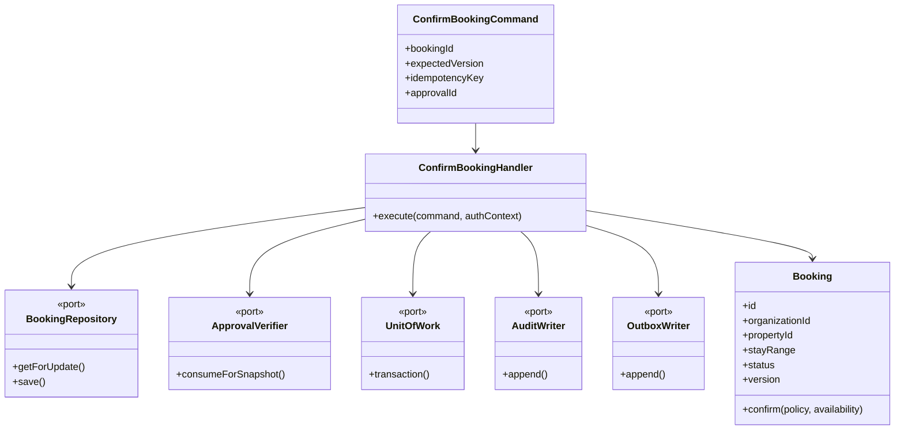
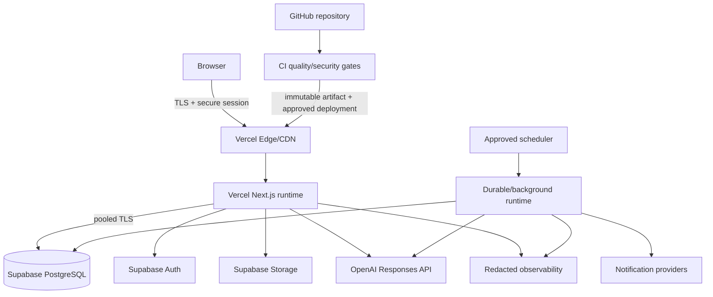

# Voya OS Architecture

**Status:** Proposed for review
**Style:** Modular monolith with Clean Architecture / DDD-inspired bounded modules and ports/adapters
**Intended stack:** Next.js, TypeScript, Supabase/PostgreSQL, Tailwind CSS, OpenAI Responses API, GitHub, Vercel

## 1. Architecture drivers

1. Cross-tenant access or financial corruption is unacceptable.
2. Confirmed booking inventory must remain correct under concurrency.
3. Financial and audit history must be non-destructive and attributable.
4. Arabic RTL and English LTR must have equivalent functionality and accessibility.
5. Sensitive actions and AI proposals require deterministic policy and human control.
6. The initial team should operate one deployable application without premature distributed-system complexity.
7. Growth must remain possible through explicit module boundaries and transactional outbox events.

Unknown scale, compliance jurisdictions, recovery objectives, and detailed finance policies are documented as open decisions rather than inferred.

## 2. Architecture options

| Option | Description | Benefits | Costs/failure modes | Fit |
|---|---|---|---|---|
| **A. Server-owned modular monolith (recommended)** | Next.js UI and server runtime contain isolated application/domain modules; Supabase provides Auth/PostgreSQL/Storage; critical writes only through server services; outbox handles async work. | Small operational surface, transactional correctness, clear boundaries, straightforward Vercel delivery, extractable modules later. | Requires discipline to prevent browser-direct writes and cross-module coupling; background work needs careful runtime choice. | Best initial fit. |
| B. Client-heavy Supabase/BaaS | Browser talks directly to most tables using RLS and database functions. | Fast CRUD delivery and realtime features. | Business logic fragments across UI/RLS/RPC; service key/function risk; approvals, idempotency, AI control, and observability become harder. | Rejected for critical workflows; acceptable only for narrowly reviewed reads. |
| C. Separate API + workers/microservices | Next.js frontend calls dedicated API; modules/services own data and async workers. | Strong deployment boundaries, independent scaling and long-running jobs. | More authentication hops, distributed consistency, deployments, monitoring, cost, and team burden before scale is known. | Future option when measured pressures justify extraction. |

**Recommendation:** Option A. Keep the browser as presentation, use server-side application services for all critical commands, apply PostgreSQL constraints/RLS as a second boundary, and design ports for Supabase, OpenAI, notifications, storage, and time. Extract a module only for measured scaling, isolation, regulatory, or ownership reasons.

## 3. C4 level 1 — system context

## 4. C4 level 2 — containers

The worker is a logical container. Before implementation, decide whether Vercel functions plus Supabase scheduling satisfy duration/retry requirements or whether a managed durable-job runtime is needed. Do not simulate a queue with unreliable fire-and-forget requests.

## 5. C4 level 3 — web application components

### Bounded modules

| Module | Owns | Depends on |
|---|---|---|
| Identity & Tenancy | organizations, memberships, invitations, policy context | Supabase Auth port, audit |
| Property & Availability | property owners, properties, ownership periods, blocks, availability queries | tenancy, booking read contract |
| CRM | leads, activities, clients, assignment/conversion | tenancy, property availability query |
| Booking | booking aggregate, versions, conflict-safe commands | tenancy, client/property references, approvals, outbox |
| Finance | payments, expenses, commissions, settlements, reversals | booking/property owner references, approvals, outbox |
| Approvals | policy versions, proposals, decisions, single-use execution authorization | tenancy; target commands through explicit contracts |
| Notifications | logical notifications, templates, outbox delivery state | domain events, provider port |
| Audit | append-only audit events and secure queries | trusted context; used by every module |
| AI Assistance | runs, tool registry/gateway, proposals, evals, budgets | authorized application-service ports only |
| Reporting | read models/queries, authorized exports | module-owned read contracts; no mutation |

Cross-module writes occur through application contracts, not direct table manipulation. Within the monolith, synchronous calls are preferred for invariants; outbox events are used for effects that may happen after commit.

## 6. C4 level 4 — booking component internals

This level is illustrative design, not source code.

The PostgreSQL adapter ultimately relies on the exclusion constraint; domain prechecks improve messaging but do not replace it.

## 7. Deployment view

Environments are isolated projects/accounts with separate databases, Auth, storage, secrets, and provider credentials. Infrastructure/configuration is declarative and reviewed; production data is not copied to previews.

## 8. Critical request and event flows

### Synchronous command

1. The server validates session, active membership, CSRF/origin where relevant, input schema, rate limit, and idempotency.
2. The policy layer authorizes action, fields, state, session assurance, and exact approval snapshot.
3. An application service opens a transaction, loads/locks aggregate state, executes domain rules, and persists through repositories.
4. PostgreSQL RLS/constraints enforce the final tenant/data invariant.
5. Audit and outbox rows commit with the change.
6. The server returns a stable localized domain result; telemetry excludes secrets and unnecessary PII.

### Asynchronous effect

1. The worker claims an outbox event with a lease/skip-locked strategy.
2. It validates schema version and performs an idempotent provider call with timeout/retry policy.
3. It records success or classified failure; retryable failures back off, terminal failures alert/dead-letter.
4. The original transaction is never rolled back by later delivery failure.

## 9. Security architecture

### Trust boundaries and principal risks

| Boundary/risk | Consequence | Required controls |
|---|---|---|
| Browser → application | Broken access control, CSRF, injection, mass assignment | Server-derived tenant context, schema allowlists, authorization on every use case, secure cookies, CSRF/origin controls, CSP, rate limits |
| Application → Supabase | RLS bypass/service-key abuse, SQL injection, cross-tenant joins | Parameterized repositories, RLS tests, narrow service role, secret manager, composite tenant FKs, reviewed security-definer functions |
| Organization-to-organization | PII/financial data leakage | Deny-default RBAC/field policy, tenant-scoped indexes/queries/cache/storage, isolation tests and audit |
| Concurrent booking writes | Double booking and compensation cost | PostgreSQL exclusion constraint, transactions, idempotency, shared locking with availability blocks |
| Finance/approval workflows | Fraud, duplicate payout, silent history rewrite | Non-delete/immutability constraints, reversals, maker-checker, proposal hash, single-use approval, reconciliation alerts |
| App → AI provider | PII leakage, prompt injection, unsafe tool execution | Minimize/redact context, DPA/retention settings, allowlisted tools, schema/policy gateway, budgets, audit/evals, no direct critical mutations |
| App/worker → providers | SSRF, webhook forgery, duplicate side effects, secret leakage | Fixed destinations, signed webhook verification, idempotency, timeouts, egress policy, rotation, redacted logs |
| CI/CD and dependencies | Supply-chain compromise, secret theft | Protected branches, pinned lockfile/actions, least-privilege OIDC, SAST/SCA, secret scan, Snyk and Trivy filesystem/config scan, SBOM/provenance |

### Security defaults

- MFA and recent reauthentication for privileged/sensitive actions; exact enforcement policy is a launch decision.
- Content Security Policy, secure/HttpOnly/SameSite cookies, output encoding, upload type/size scanning, and no user-controlled outbound URLs.
- Secrets only in managed environment stores; distinct per environment; rotation and access alerts.
- Signed webhook verification uses raw-body-safe handling, replay windows, and durable event deduplication.
- Logs/traces/errors are structured and redacted; production source maps and diagnostics do not disclose secrets.
- Data retention, residency, privacy rights, and incident notification are jurisdiction-dependent launch blockers.

## 10. Reliability, observability, and performance

- Define SLO/RPO/RTO after expected scale and business hours are supplied. Before production, establish dashboards and alerts for error/latency, DB saturation, booking conflicts, RLS denials, approval backlog, outbox age/failures, financial reconciliation exceptions, audit write failures, and AI spend/safety blocks.
- Correlation and causation IDs connect HTTP commands, DB audit events, outbox delivery, and AI/tool runs.
- External calls use explicit timeouts, bounded retries with jitter, and circuit breaking where supported. No unbounded agent or worker loops.
- Core booking/finance operations do not depend synchronously on AI or notification availability.
- Use tenant-leading indexes, bounded pagination, production-shaped query-plan tests, connection pooling, and per-tenant abuse/rate controls.
- Backups are encrypted and restore-tested; runbooks cover provider outage, DB degradation, suspected tenant leak, duplicate booking, incorrect settlement, and compromised credentials.

## 11. Delivery and GitOps

- Git is the source of truth for schema migrations, environment configuration, policies, prompts/tools, and deployment definitions.
- CI order: format/lint/typecheck; unit/integration/database/E2E tests; migration/RLS checks; SAST/SCA/secret scanning; Snyk; Trivy filesystem/config scan; build/SBOM; approved preview; production deployment.
- Use immutable build outputs, protected production environments, least-privilege GitHub OIDC where available, pinned actions, and artifact provenance.
- Database changes use expand/contract and are deployed before compatible application code. Feature flags isolate risky workflows and each AI agent.
- Rollback disables flags/reverts application artifacts; schema is forward-fixed unless a tested non-destructive rollback is safe.

## 12. Architecture decision records

### ADR-001: Begin with a server-owned modular monolith

- **Status:** Proposed
- **Context:** Strong transactional workflows and an unknown initial scale favor low distributed-system complexity.
- **Decision:** Deploy one Next.js application with internal bounded modules, plus a logical background worker and external managed services.
- **Consequences:** Faster coherent delivery and local transactions; architectural tests and ownership rules must prevent coupling. Extraction remains possible via ports/outbox.

### ADR-002: PostgreSQL is the source of truth and tenant boundary

- **Status:** Proposed
- **Decision:** Every tenant-owned record is scoped by `organization_id`; server authorization is backed by RLS, tenant-consistent foreign keys, and restricted grants.
- **Consequences:** Strong defense in depth; RLS/service-role complexity requires dedicated integration tests and operational discipline.

### ADR-003: Enforce confirmed-booking non-overlap in PostgreSQL

- **Status:** Proposed
- **Decision:** Use half-open date ranges and a GiST exclusion constraint for confirmed bookings; coordinate blocks through a single transaction/lock protocol initially.
- **Consequences:** Correct under concurrency; conflict errors need translation, and occupancy design must be revisited if holds/blocks grow complex.

### ADR-004: Financial history is append-oriented

- **Status:** Proposed
- **Decision:** Revoke/reject hard deletion, freeze posted/finalized facts, and correct via linked reversal/superseding records.
- **Consequences:** Reliable audit/reconciliation at the cost of more explicit lifecycle and reporting logic. This does not settle the full accounting model.

### ADR-005: Sensitive actions use versioned maker-checker approvals

- **Status:** Proposed
- **Decision:** Approvals bind to a canonical proposal snapshot, policy version, eligible independent approver(s), expiry, and single execution.
- **Consequences:** Reduces fraud/error risk; adds workflow latency and requires business-owned policy/coverage for small teams.

### ADR-006: AI uses controlled tools and proposal-only critical actions

- **Status:** Proposed
- **Decision:** A server orchestrator exposes allowlisted, schema-validated application tools. Booking/finance tools can only read or create proposals; humans and deterministic services execute authorized commands.
- **Consequences:** Limits autonomy but protects source-of-record integrity and provides traceability/evaluation.

### ADR-007: Transactional outbox for post-commit effects

- **Status:** Proposed
- **Decision:** Store notification, integration, and async AI work intents in the business transaction and process idempotently.
- **Consequences:** Avoids lost side effects; requires a durable worker, retry/dead-letter policy, schema versions, and monitoring.

### ADR-008: Arabic-first internationalized presentation

- **Status:** Proposed
- **Decision:** Arabic/RTL is the default, English/LTR equivalent, while domain/storage values remain locale-neutral.
- **Consequences:** Localization, bidi, accessibility, export, and visual regression testing are release gates from the first vertical slice.

## 13. Handover and implementation readiness

Before code begins, product/finance/security/engineering should:

1. Resolve launch jurisdiction, tenancy/support model, scale/SLO/RPO/RTO, and financial/booking/approval policies in the PRD.
2. Approve the role/field matrix and identify every sensitive command plus maker-checker fallback.
3. Choose property-unit and occupancy/hold semantics; validate the database model with representative scenarios.
4. Decide the worker runtime, notification/payment providers in scope, and Supabase/Vercel environment topology.
5. Complete privacy classification, retention, threat model, incident response, backup/restore, and support-access design.
6. Turn ADRs from Proposed to Accepted/Rejected and assign decision owners/dates.
7. Build a thin walking skeleton only after documentation review: auth/tenant boundary → one property → conflict-safe booking → audit/approval → finance slice → AI proposal.

Suggested ownership:

| Area | Accountable reviewer | Handover evidence |
|---|---|---|
| Product and finance policy | Product lead + finance/legal owner | Approved rule tables and worked examples |
| Architecture and database | Tech lead + database owner | Accepted ADRs, migration design, query/concurrency test plan |
| Security and privacy | Security/privacy owner | Threat model, data inventory, access model, incident/retention decisions |
| QA and release | QA lead + engineering lead | Traceability matrix, environments, test data, release gates |
| AI governance | Product + security + AI owner | Tool registry, eval set/thresholds, data-use policy, rollback/kill switch |

## 14. Open architecture decisions

- Expected scale, regional deployment/data residency, SLO, RPO, RTO, and availability tier.
- Vercel/Supabase plan capabilities, connection pool mode, and durable background-job runtime.
- Notification/payment providers, webhook/integration contract, and PCI scope.
- Property/building/unit hierarchy, holds, block concurrency, and channel synchronization.
- Support access, platform administration, break-glass, and customer-controlled support authorization.
- Whether a formal accounting ledger, WORM audit export, encryption/tokenization service, or dedicated analytics store is required.
