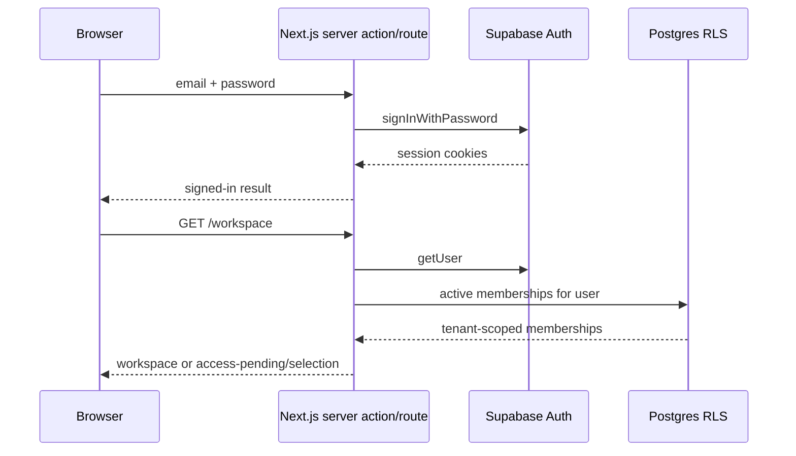

# Voya authentication flow

The sign-in screen is a thin frontend over server-owned Supabase authentication. It never receives a service-role key, organization ID, or redirect destination from the browser.

## Password sign-in

`/sign-in` renders `PasswordSignInForm`. Its server action calls `createServerPasswordGateway`, which uses `createServerSupabaseClient` and writes the Supabase SSR session cookies through Next's writable cookie store. The client navigates to `/workspace` only after the server action returns `signed_in`; the workspace then re-checks the user and active membership on the server.

## Magic-link sign-in

`SignInForm` calls `requestSignInAction`. The server derives `/auth/callback` from the trusted `VOYA_APP_URL` and calls `signInWithOtp` with an explicit PKCE server client. The browser receives the PKCE verifier cookie. Supabase's normal PKCE email link returns `?code=...`; `/auth/callback` exchanges it, loads the user, checks active membership, and redirects only to `/workspace` or `/access-pending`.

Supabase email templates that use `{{ .TokenHash }}` are also supported through `?token_hash=...&type=...`; the route verifies the one-time token server-side and never logs it. A link that ends in a URL fragment containing `access_token` is an implicit-flow link and is not interchangeable with the PKCE contract. Configure the Supabase template and redirect URLs for PKCE or the token-hash contract instead of sending implicit tokens to the server callback.

As a compatibility bridge for older/local Supabase email settings, the root
route forwards `/?code=...` and `/?token_hash=...` to the same internal
`/auth/callback` endpoint. It preserves only the one-time auth parameters and
does not accept a user-supplied destination. New provider configuration should
still target `/auth/callback` directly.

## Failure meanings

- `429` from `/otp`: provider email throttling; the browser does not add another
  artificial cooldown. Use the newest link that arrived or the password path;
  the database-owned server limiter still protects the provider from repeated
  sends.
- `/access-pending`: authentication succeeded or the callback completed, but there is no active membership (or the link was invalid/expired).
- `/workspace` redirect to `/sign-in`: no valid SSR session reached the server.
- Multi-membership users see the organization selector; the selected organization is validated against the authenticated user's memberships.

## Required deployment configuration

Set `NEXT_PUBLIC_SUPABASE_URL`, `NEXT_PUBLIC_SUPABASE_PUBLISHABLE_KEY`,
`VOYA_APP_URL`, and the server-only `AUTH_RATE_LIMIT_HMAC_SECRET` in the
deployment environment. In Supabase Auth, set the Site URL and an additional
redirect URL for the exact deployed origin plus `/auth/callback`. Do not use
`localhost` or an old preview origin in production email templates.
