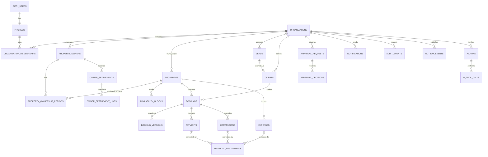
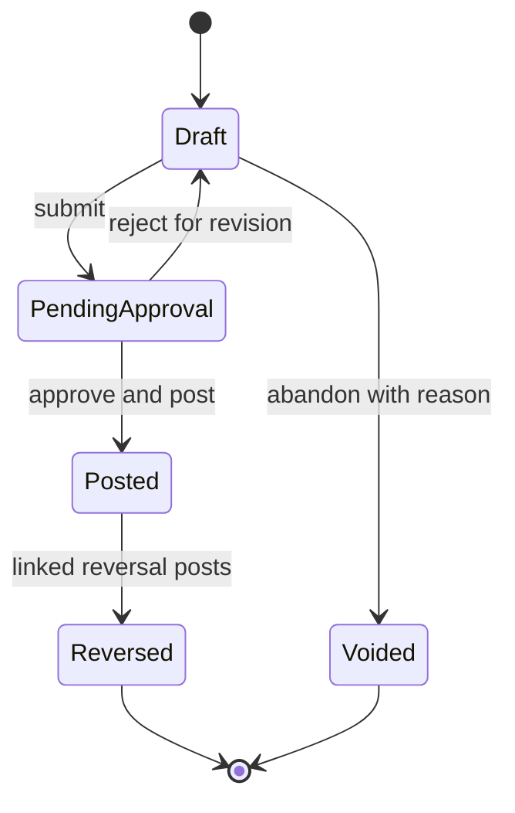
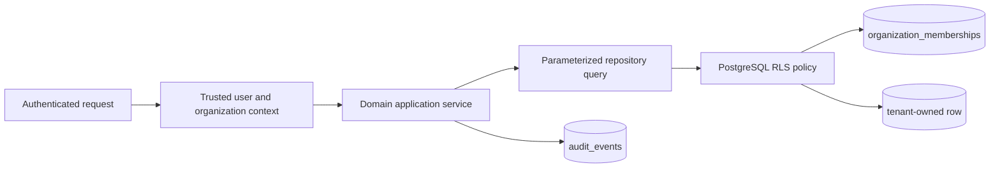

# Voya OS Database Architecture

**Status:** Draft for review
**Platform:** Supabase-managed PostgreSQL
**Design priorities:** tenant isolation, booking correctness, financial immutability, auditability, reversible migrations

## 1. Database responsibilities

PostgreSQL is the authoritative transactional store. It must enforce invariants that cannot safely depend on UI or application timing:

- tenant ownership and referential consistency;
- valid ranges and state values;
- no overlapping confirmed bookings for the same bookable property;
- no hard deletion of financial or audit records;
- immutability of posted/finalized financial facts;
- unique idempotency and external-source references;
- durable approval, audit, and outbox records.

Application services remain responsible for business workflows, permissions, policy evaluation, localized errors, and orchestration. RLS and constraints provide defense in depth, not a substitute for domain services.

## 2. Global conventions

- Primary keys: UUIDv7-compatible UUIDs generated server/database side; exact generator depends on supported PostgreSQL/Supabase version.
- Tenant tables: non-null `organization_id` with indexed foreign key.
- Time: `timestamptz` in UTC for events; property-local `date` for nightly stay boundaries; explicit IANA time zone on property/organization.
- Stay semantics: `[check_in, check_out)` so a checkout and next check-in may share a date.
- Money: `bigint` minor units plus ISO 4217 `currency_code`; no floating point.
- Names/status values: stable lowercase identifiers. Use lookup/config tables when business-managed; PostgreSQL enums only for truly stable technical states.
- Lifecycle: `created_at`, `created_by_membership_id`, and where allowed `updated_at`, `updated_by_membership_id`; no generic soft-delete assumption for finance/audit.
- Optimistic concurrency: integer `version` on mutable aggregates; commands include expected version.
- Idempotency: organization + command scope + key, with request hash and stored result reference.
- Sensitive payloads: minimize, classify, encrypt selectively where required, and never store secrets/raw card data.

## 3. Logical data model



The diagram is conceptual. Exact foreign keys and normalization are migration design work after policy review.

## 4. Table catalog

### Identity and policy

| Table | Purpose and key fields | Important constraints |
|---|---|---|
| `profiles` | Application profile linked 1:1 to Supabase Auth user | No tenant role stored here |
| `organizations` | Tenant root; name, slug, locale, timezone, status | Unique normalized slug; protected status transitions |
| `organization_memberships` | user ↔ organization, role, status, policy version | Unique `(organization_id, user_id)`; valid role/status; last-owner invariant |
| `role_policies` | Versioned capability/field policy if policy moves beyond code | Effective date/version immutable after activation |
| `approval_policies` | Versioned action, thresholds, approver constraints | No guessed finance thresholds; immutable active versions |

### Supply, CRM, and booking

| Table | Purpose and key fields | Important constraints/indexes |
|---|---|---|
| `property_owners` | Party record, contact and payout metadata references | Tenant-scoped dedupe hints; sensitive fields restricted |
| `properties` | One bookable apartment; owner-facing code, address, timezone, status | Unique tenant code; active-status checks |
| `property_ownership_periods` | Historical owner assignment with effective date range | No unexplained overlap; historical rows retained |
| `availability_blocks` | Maintenance/owner-use/admin closure over `[start_date,end_date)` | Valid range; indexed GiST range; cross-check with confirmed bookings in command transaction |
| `leads` | Pipeline, request dates, source, assignee, contact data | Tenant + status/assignee indexes; normalized contact indexes as policy permits |
| `lead_activities` | Append-oriented timeline | No silent rewrite; tenant/lead consistency |
| `clients` | Canonical client within an organization | Tenant-scoped dedupe keys; restricted PII |
| `bookings` | Current booking identity/state, client, property, stay dates, current version | Exclusion constraint for confirmed overlaps; idempotent transitions |
| `booking_versions` | Immutable commercial/date/status snapshots for proposals and history | Unique booking + version; snapshot hash |

### Finance

| Table | Purpose and key fields | Important constraints/indexes |
|---|---|---|
| `payments` | Expected/received/refunded/reversed payment facts and provider references | No delete; unique provider/source key; nonzero valid amount; currency required |
| `expenses` | Expense evidence and attribution | No delete; draft/post/reverse state; evidence requirements policy-driven |
| `commissions` | Human/policy-derived commission proposal and posting | No delete; calculation policy/version and basis snapshot required |
| `financial_adjustments` | Reversal/superseding facts linked to an original finance record | No delete; one applicable reversal per source/event; reason required |
| `owner_settlements` | Owner-period statement versions and lifecycle | No delete; unique version; finalized snapshots immutable |
| `owner_settlement_lines` | Snapshot of included source, amount, currency, reason | No delete; unique source/version; sum checks within same currency |

These tables form an operational subledger, not a claim of a complete double-entry general ledger. Whether a formal journal/account model is required is an open finance decision.

### Governance and operations

| Table | Purpose and key fields | Important constraints/indexes |
|---|---|---|
| `approval_requests` | Exact proposed command snapshot/hash, state, policy version, expiry | No proposal mutation after submit; one execution; tenant/resource consistency |
| `approval_decisions` | Immutable decision by membership with reason | Unique decision per approver/request; maker-checker checks |
| `notifications` | Logical recipient notification and read state | Tenant + recipient consistency; dedupe key |
| `notification_deliveries` | Channel attempts, provider result class, retries | No secret/provider payload leakage; unique attempt/dedupe |
| `audit_events` | Append-only actor/action/resource/outcome/delta | No update/delete; indexed tenant/time/resource/actor |
| `outbox_events` | Transactionally staged side effects | Unique event ID; claim/retry state; payload schema version |
| `idempotency_records` | Command request hash and result | Unique organization/scope/key; expiry policy |
| `ai_runs` | Initiator, purpose, model/prompt version, status, usage | Redacted/minimized content; tenant/user indexes |
| `ai_tool_calls` | Tool/version, sanitized args, policy result, effect/proposal | Linked run; no secrets; idempotency and approval link |

## 5. Booking overlap invariant

The database must be the final arbiter under concurrency. A preflight availability query is useful for UX but insufficient.

Migration design (illustrative, not application-ready):

```sql
CREATE SCHEMA IF NOT EXISTS extensions;
CREATE EXTENSION IF NOT EXISTS btree_gist WITH SCHEMA extensions;

ALTER TABLE bookings
  ADD CONSTRAINT bookings_valid_stay
  CHECK (check_in < check_out),
  ADD CONSTRAINT bookings_no_confirmed_overlap
  EXCLUDE USING gist (
    organization_id WITH =,
    property_id WITH =,
    daterange(check_in, check_out, '[)') WITH &&
  ) WHERE (status = 'confirmed');
```

Design requirements:

- Keep `organization_id` in the exclusion key even if property IDs are globally unique, so tenant intent is explicit.
- Map exclusion violations to a stable domain conflict without exposing SQL details.
- Confirmation performs state, approval, property, block, and price-snapshot checks in the same transaction.
- Updates to confirmed dates are subject to the same constraint.
- Adjacent stays do not overlap under `[)` semantics.
- Manual availability blocks are a separate table. Because a PostgreSQL exclusion constraint cannot span tables, the confirmation/block commands need a shared per-property transactional advisory lock or a future unified occupancy table, then checks under that lock. The chosen design must be concurrency-tested.
- Cancellation releases the confirmed-booking exclusion only after the status transition commits; history remains.

### Occupancy design options

1. **Booking exclusion + locked availability-block commands (recommended initially):** least schema duplication; all block/confirm paths must use one lock discipline.
2. **Unified `occupancy_reservations` table:** bookings and blocks write active occupancy rows protected by one exclusion constraint; strongest shared invariant but requires strict synchronization and more lifecycle complexity.
3. **Serializable transactions only:** fewer structures but higher retry/operational complexity and easier bypass; not recommended as the sole protection.

Decision to adopt option 1 is provisional until held-booking and block semantics are approved.

## 6. Financial immutability and corrections



- `DELETE` is revoked from application roles and rejected by a trigger for payments, expenses, commissions, adjustments, settlements, settlement lines, and audit events. This includes drafts: they may become `voided`, not disappear.
- Posted/finalized business columns are immutable. Non-business operational metadata must be narrowly allowlisted.
- A correction inserts a linked reversal or superseding version. It never rewrites a finalized statement.
- Settlement line items copy the source identity, source version, amount, currency, attribution, and rule version at preparation time.
- Idempotency/source unique keys protect provider callbacks, import retries, reversals, posting, and settlement finalization.
- Database roles used for migrations are privileged; production migration execution is separately approved and audited because owner-level PostgreSQL privileges can bypass application triggers/RLS.

## 7. Tenant isolation and RLS



- Enable and force RLS on all exposed tenant tables where compatible with operational roles.
- Policies check `auth.uid()` against an active membership and the row's `organization_id`; capability checks may use carefully reviewed helper functions.
- Composite foreign keys such as `(organization_id, property_id)` reference tenant-qualified unique parent keys where practical.
- Storage object paths include a server-validated organization prefix and use matching Storage RLS.
- Realtime subscriptions, RPC functions, views, materialized views, exports, and backups are part of the tenant boundary and receive explicit tests.
- Do not rely on a caller-set session variable from the browser for organization identity.
- Service-role operations use a separate server/worker adapter that repeats domain authorization or is limited to internal event processing with a narrow capability.

### Enforced remediation invariants

- Every discovered foreign key between tenant-owned CRM, WhatsApp, booking, operations, fleet, approval, AI, notification, and property rows pairs child and parent `organization_id`; polymorphic audit/notification resource identifiers remain intentionally non-relational.
- Booking approval requests and confirmations persist `(organization_id, command_name, idempotency_key, booking_id)`. Confirmation also validates the exact approved snapshot and a strictly future expiry while holding row locks.
- Booking stay-event retries match organization, booking, event type, normalized notes, and idempotency key. A changed logical command fails instead of returning an unrelated row.
- Transport allocations use `[pickup_at, return_at)` and occupy a vehicle or driver only in `assigned` or `in_progress`. A null `return_at` is unbounded until `completed` or `cancelled`; PostgreSQL exclusion constraints serialize conflicts across simultaneous transactions.
- Transport and operations commands use row-locked forward-only transition matrices. Same-state retries succeed without new evidence; `completed` and `cancelled` remain terminal.
- Migration `20260803085546_production_security_remediation.sql` is forward-only, preserves the legacy exact-policy rate RPC for rolling deploys, validates new FKs before dropping old ones, and fails closed on incompatible existing data.

## 8. Audit model

An `audit_events` row includes:

- event ID, organization ID, occurred/recorded timestamps;
- actor type (`user`, `ai_on_behalf_of_user`, `system`, `support`) and stable actor/membership IDs;
- source channel, request/correlation/causation IDs, IP/device metadata only where lawful;
- action, resource type/ID/version, outcome and reason/error class;
- redacted structured before/after delta or a reference to an immutable snapshot;
- policy, tool, prompt/model, and approval identifiers when applicable.

Critical audit writes occur in the state-change transaction. Operational audit delivery to external observability may use the outbox. Restrict direct table ownership, alert on audit write failures, and decide whether cryptographic chaining/WORM export is needed for the launch jurisdictions.

## 9. Indexing and query safety

- Leading tenant indexes for common lists: `(organization_id, status, created_at desc)` and domain-specific variants.
- GiST indexes for date ranges; uniqueness on idempotency/provider references within their tenant/source scope.
- Partial indexes for active memberships, pending approvals, unprocessed outbox, unread notifications, and current open workflow states.
- Cursor pagination for growing lists/audit; bounded date ranges for exports and reports.
- Query plans are tested with production-shaped tenant cardinalities to detect sequential scans, N+1 patterns, and noisy-neighbor risks.
- Connection pooling and transaction mode must be compatible with prepared statements, RLS context, advisory locks, and serverless execution.

## 10. Migration, backup, and recovery

- Use declarative SQL migrations in Git with review and checksums; Supabase dashboard drift is prohibited.
- Apply expand/contract: add nullable/backward-compatible structures, backfill in bounded batches, dual-read/write only when necessary, validate, then constrain/remove in a later release.
- Create large indexes concurrently where supported; set lock/statement timeouts and assess table rewrites.
- Never make a destructive down migration the primary rollback. Roll back application behavior and forward-fix schema.
- Run schema lint, migration tests, RLS tests, and production-size rehearsal before deploy.
- Use managed point-in-time recovery when available; define RPO/RTO, encrypt backups, restrict restore access, and run restore drills.
- Sanitized/synthetic data only in lower environments; production copies require explicit security/privacy approval.

## 11. Data retention and deletion

- Financial and audit history is retained according to legal/business policy and never hard deleted through normal product operations.
- PII deletion/anonymization must preserve referential and financial evidence while meeting applicable law; the exact transformation requires jurisdictional review.
- Authentication deletion must not orphan actor attribution; preserve a non-sensitive stable subject reference or tombstone.
- Define retention separately for leads, conversations, AI inputs/outputs, notifications, exports, idempotency records, logs, and backups.
- Legal holds override ordinary expiry through a separately authorized, audited process.

## 12. Database acceptance and security tests

- Concurrent inserts/updates prove exactly one overlapping confirmation succeeds and adjacent stays succeed.
- Every tenant relation rejects cross-tenant direct access, nested joins, RPCs, realtime subscriptions, storage references, and forged IDs.
- Every financial/audit table rejects hard delete; posted/finalized fields reject mutation; reversal replay fails.
- Cross-tenant foreign keys, orphan records, invalid date ranges, invalid currency/amount, duplicate provider events, and reused idempotency keys fail safely.
- Approval snapshot tampering, self-approval, expired/replayed approval, and changed policy/state cannot execute.
- Migration from previous version and rollback-compatible application behavior are tested on representative volume.
- Backup restore proves row counts, constraints, RLS, ownership, and audit/financial integrity.

## 13. Open database decisions

- Property/building/unit hierarchy and whether one property can contain multiple independently bookable units.
- Held inventory semantics and whether to adopt a unified occupancy table.
- Full accounting journal versus operational subledger; chart of accounts and recognition policy.
- Multi-currency, precision exceptions, rate sources, rounding, and historical reporting.
- PII encryption/tokenization scope, search requirements, residency, retention, anonymization, and legal holds.
- Expected scale, pooling mode, index/cardinality targets, partitioning threshold, RPO, and RTO.
- Audit tamper-evidence/WORM requirement and access retention.
