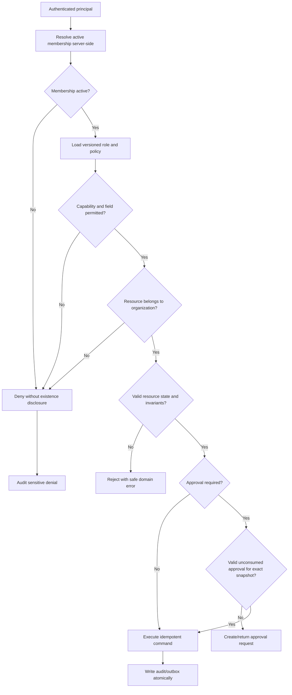

# Voya OS Permissions and Approval Model

**Status:** Draft for review
**Security posture:** deny by default, least privilege, tenant-scoped, server-enforced, database defense in depth

## 1. Role definitions

- `owner`: organization owner. Full tenant administration and business oversight, subject to separation of duties and approval policy.
- `manager`: operational administrator without ownership-transfer or last-owner authority.
- `sales_agent`: lead/client workflow and booking proposals; no financial posting.
- `operations`: property, availability, and permitted booking operations; no financial posting.
- `accountant`: finance preparation/posting as policy permits; no membership administration.
- `viewer`: read-only access to a deliberately restricted dataset, not an automatic read of every table.

Property owners are business records and are not automatically application users. Platform support/administration is outside this tenant role model and must use separate just-in-time privileged access with audit and customer authorization.

## 2. Baseline role matrix

Legend: `A` administer, `M` mutate, `P` propose/submit, `R` read, `—` denied. Any `M` remains subject to state, field, approval, and separation-of-duties policy.

| Capability | owner | manager | sales_agent | operations | accountant | viewer |
|---|---:|---:|---:|---:|---:|---:|
| Organization settings | A | R/M limited | — | — | R limited | — |
| Memberships and invitations | A | M except owner controls | — | — | — | — |
| Role/owner transfer | A + approval | — | — | — | — | — |
| Property-owner records | A | M | R limited | M | R | R limited |
| Properties | A | M | R | M | R | R |
| Availability blocks | A | M | R | M | R | R |
| Leads and activities | A | M | M assigned/team policy | R/M limited | R limited | R limited |
| Clients | A | M | M assigned/team policy | R/M limited | R limited | R limited |
| Booking drafts/proposals | A | M | P/M own drafts | M | R | R limited |
| Booking confirmation/amend/cancel | M + policy | M + policy | P | M + policy | R/P financial effect | R |
| Payments | A + policy | R/P | R limited | R limited | M + policy | R limited |
| Expenses | A + policy | P/M limited | P own if allowed | P own if allowed | M + policy | R limited |
| Commissions | A + policy | R/P | R own limited | — | M + policy | R limited |
| Owner settlements | A + policy | R/approve by policy | — | — | P/M + policy | R limited |
| Approval requests | R/decide eligible | R/decide eligible | R own/P | R own/P | R own/P/decide eligible | — |
| Notifications | R own | R own | R own | R own | R own | R own |
| Operational reports | R | R | R scoped | R | R | R limited |
| Financial reports | R | R limited | R own commission limited | R limited | R | R limited by policy |
| Audit log | R | R | R own limited | R own limited | R finance limited | — |
| AI assistants | use permitted agents/tools | use permitted agents/tools | sales + booking | booking + manager summaries limited | finance | read-only assistant if enabled |
| Exports | policy + audit | policy + audit | scoped + audit | scoped + audit | finance + audit | denied by default |

This matrix is a safe baseline, not a finalized business policy. Field-level visibility, manager membership rights, booking operations, export rights, and approval eligibility require product-owner sign-off.

## 3. Authorization evaluation



Authorization context includes user ID, active membership ID, organization ID, role/policy version, session assurance (including MFA), request ID, source channel, and impersonation/support context if applicable. Clients and AI models may not choose or override these fields.

## 4. Resource and field rules

- All queries scope by `organization_id`; child joins additionally verify parent organization consistency.
- Assignment-based sales access must be expressed as policy, not client filtering.
- Contact details, identity documents, bank details, payment references, notes, exports, and AI context are sensitive fields with explicit read rules and redaction.
- Financial amounts exposed to sales/operations/viewer roles require field-level policy; totals are not assumed harmless.
- Audit payloads are redacted at write time. Redaction is not delegated to the UI.
- Ownership transfer, role elevation, MFA reset, exports, and bulk actions require stronger session assurance and recent reauthentication.

## 5. Sensitive-action approval policy

The approval engine is generic, but business policies must be configured and versioned. Candidate actions are listed below; their threshold and approver count remain open unless stated as an invariant.

| Action | Baseline handling | Unresolved policy |
|---|---|---|
| Transfer organization ownership / elevate to owner | Always independent approval and recent MFA | Who may co-approve; break-glass process |
| Confirm/amend/cancel booking | Role and state check; approval when policy says | Which changes and values require approval |
| Override availability/property restriction | Always approval; cannot override confirmed-overlap constraint | Eligible roles and emergency procedure |
| Post/reverse/refund payment | Finance proposal and independent approval where configured | Amount thresholds, provider workflow |
| Post/reverse expense or commission | Versioned rule and approval | Thresholds, evidence, approver roles |
| Finalize/reopen/reverse settlement | Independent approval | Number of approvers and period controls |
| Export sensitive/bulk data | Reauthentication, audit, approval by policy | Size thresholds and allowed roles |
| Change approval/financial policy | Always independent approval and versioning | Governance owner and effective-date rules |

Mandatory mechanics:

- maker and checker cannot be the same membership when separation of duties applies;
- proposal snapshots are canonicalized and hashed; any material change supersedes prior decisions;
- policy and approver permission are checked both at decision and execution;
- approval has expiry, decision reason, immutable history, and single-use execution;
- database/domain invariants cannot be waived by an approval;
- emergency access, if introduced, is time-bound, independently alerted, reviewed, and never hides its audit trail.

## 6. Database enforcement

- Supabase Row Level Security is enabled on every exposed tenant table and denies access when no active membership matches the row's `organization_id`.
- Critical mutations use reviewed server-side commands. Browser roles do not receive direct update/delete grants on booking, finance, approval, or audit source-of-record tables.
- Foreign keys include or otherwise enforce organization consistency to prevent a child in tenant A from referencing a parent in tenant B.
- Financial and audit tables reject hard deletion through grants and database triggers; posted immutable fields reject update.
- Security-definer functions are exceptional, schema-qualified, set a safe `search_path`, validate membership/policy, and receive focused review/tests.
- The Supabase service-role key bypasses RLS and is server-only, narrowly used, rotated, monitored, and never placed in `NEXT_PUBLIC_*` variables.

Representative RLS intent, not migration-ready SQL:

```text
ALLOW row access only when
  authenticated_user has an active organization_membership
  AND membership.organization_id = row.organization_id
  AND the versioned role policy permits action + resource + fields
  AND any assignment/state/session conditions are satisfied.
```

## 7. AI and automation principals

- An AI run acts on behalf of the initiating membership and never gains a broader role.
- The tool gateway ignores tenant/user identifiers supplied by the model and injects trusted context.
- Read tools return minimum required, redacted fields and bounded result sizes.
- Non-financial, non-booking writes may be enabled per tool only after schema validation, policy evaluation, idempotency, and audit.
- Booking and financial tools create proposals or approval requests only; a deterministic human-authorized command performs the eventual mutation.
- AI cannot decide approvals, manage roles, export bulk sensitive data, retrieve secrets, or execute arbitrary SQL/HTTP/code.

## 8. Authorization test requirements

- Generate a role × action × resource-state test matrix for server policies and RLS.
- For every tenant table, prove same-tenant allow cases and cross-tenant deny cases using guessed IDs, joins, filters, RPCs, realtime, exports, and storage paths.
- Test stale sessions after suspension/role change, last-owner invariant, self-approval denial, approval replay, proposal tampering, and policy-version changes.
- Test service-role code paths separately and fail CI if privileged credentials enter client bundles.
- Test field-level redaction in UI, API, logs, audit, notifications, exports, and AI tool responses.

## 9. Open authorization decisions

- Whether managers may invite/remove non-owner members or change their roles.
- Whether sales access is assignee-only, team-wide, or organization-wide.
- Which booking transitions operations can execute without approval.
- Financial fields visible to manager, operations, sales, and viewer roles.
- Who can approve each sensitive action, required counts, thresholds, and fallback when no independent approver exists.
- Support access, impersonation, property-owner portal access, and break-glass governance.
- MFA enforcement, session duration, reauthentication interval, and device/session revocation requirements.
