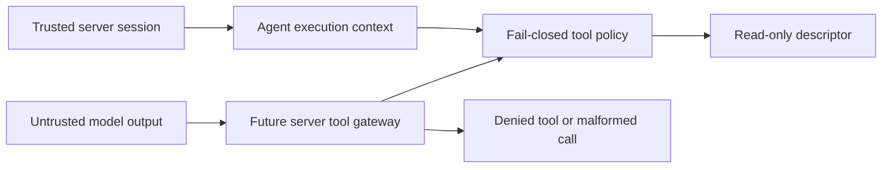

# Security Review: AI Tool Policy Gateway

**Scope:** `src/domain/ai/tool-policy.ts` and its unit tests.

## Decision

Approved as a narrow, pre-provider foundation. This module is not an AI runtime and does not call OpenAI, Supabase, the network, a shell, or a browser.

## Trust boundary

The `organizationId`, `membershipId`, agent kind, and role are required trusted context. They are not exposed as model tool arguments. A future route handler must construct this context from the authenticated session and active membership; it must never accept it from the browser or model output.

## Controls verified

- Unknown tool names fail closed with `AI tool is not allowed`.
- Finance exposes no tool while financial rules, records, and approval policies are unresolved.
- The registry has no booking command, financial command, approval, SQL, HTTP, shell, code execution, external messaging, or bulk-export descriptor.
- `search_properties_v1` and `check_availability_v1` are explicitly `read` effects only.
- Agent/role grants are paired; an operations membership cannot gain manager-agent access through a shared descriptor.
- Tool schemas have no `organizationId` or `membershipId` argument, preventing model-controlled tenant or actor selection at this layer.

## Residual risks and launch blockers

- This policy does not yet execute tools, validate input schemas, query tenant-scoped data, rate-limit runs, audit AI calls, or apply output redaction. A future gateway must independently perform each control.
- There is no OpenAI Responses API adapter, API key configuration, run persistence, budget enforcement, kill switch, provider fallback, or evaluation harness. No AI agent is enabled.
- A descriptor marked `read` is not a proof that its eventual handler is read-only. Each handler needs application-service authorization, RLS-backed integration tests, result limits, PII field policy, and an audit event.
- Booking and finance proposals must remain unavailable until the proposal/approval policy, source snapshots, revalidation, and deterministic command contracts are implemented and security-reviewed.
- The tool registry is intentionally small. Adding a tool requires a threat review, negative authorization tests, tool-schema validation, redaction policy, and a documented owner.

## Provider implementation guidance

When the provider adapter is introduced, it must use only custom function tools with strict schemas and a server-side tool gateway. The OpenAI Responses API tool guide documents custom functions with `additionalProperties: false` and `strict: true`; Voya OS must retain its own authorization boundary instead of treating a model tool choice as authorization. [OpenAI tool guide](https://developers.openai.com/api/docs/guides/tools)

## Evidence required before enabling an agent

1. Fake-provider integration tests prove tenant, role, field-redaction, timeout, and unknown-tool rejection paths.
2. An append-only AI-run/tool audit design is migrated and covered by database tests.
3. Per-agent budgets, concurrency limits, kill switch, and redacted telemetry are tested.
4. Arabic and English adversarial evaluations show no direct booking/financial mutation, cross-tenant disclosure, prompt-injection tool bypass, or self-approval.
5. A reviewed provider privacy/retention configuration and production secret-management plan are in place.
