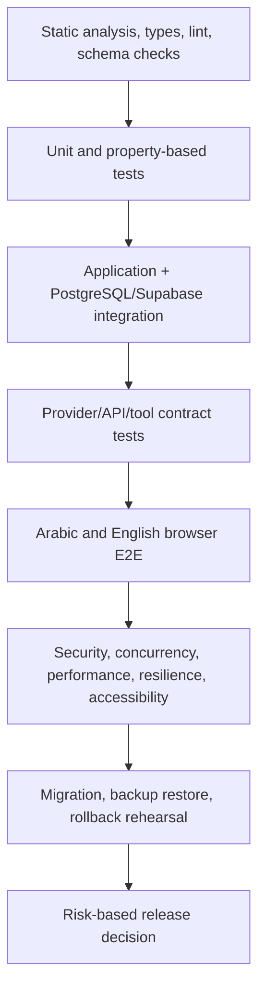

# Voya OS Test and Quality Plan

**Status:** Draft for review
**Quality order:** Security → Correctness → Performance → Observability → Maintainability

## 1. Objectives

- Prove tenant, role, field, state, and approval boundaries across every access path.
- Prove booking and financial invariants under concurrency, retries, failures, and recovery.
- Prove Arabic RTL and English LTR workflows are functionally equivalent, responsive, and accessible.
- Prove external services and AI fail without corrupting core state or leaking data.
- Provide release evidence traceable to PRD requirements, migrations, ADRs, and known risks.

No application release is production-ready merely because happy-path UI tests pass.

## 2. Test strategy

Tests run at the lowest effective layer, with database and end-to-end coverage retained for boundaries that mocks cannot prove. Aim for more than 90% unit coverage where meaningful; do not optimize coverage numbers with low-value tests. Critical tenant authorization, booking transitions/conflicts, approval consumption, and finance posting/reversal logic require exhaustive decision/branch coverage and mutation testing where feasible.

## 3. Environments and test data

- Unit tests: deterministic clock/ID/provider ports, no network, fast parallel execution.
- Integration: ephemeral/local Supabase-compatible PostgreSQL with real migrations, RLS, roles, constraints, and transactions.
- Preview: isolated Supabase/Vercel resources per approved lifecycle; synthetic data only; no production secrets.
- Staging: production-like topology, sanitized/synthetic scale data, provider sandboxes, restore/rollback rehearsals.
- Production: smoke checks and synthetic monitors that cannot create real financial obligations or bookings without an explicitly isolated test tenant.

Test fixtures include at least two organizations with intentionally similar identifiers/data to expose missing tenant predicates, all six roles, suspended/changed memberships, Arabic/English content, multiple property time zones, concurrent bookings, and complete finance/approval lifecycles.

## 4. Requirement traceability

| Requirement/risk | Primary evidence |
|---|---|
| FR-1 tenancy and roles | Policy unit matrix, RLS integration matrix, cross-tenant E2E/security tests |
| FR-2 Arabic/English/accessibility | locale unit tests, RTL/LTR visual regression, automated + manual WCAG checks |
| FR-3 property/availability | domain and DB constraint tests, concurrency tests, operational E2E |
| FR-4 leads/clients | normalization/dedup property tests, assignment authorization, conversion E2E |
| FR-5 bookings | state-machine unit tests, exclusion/migration/concurrency integration, confirmation/cancellation E2E |
| FR-6 finance | amount/currency/property tests, no-delete/immutability/reversal integration, reconciliation E2E |
| FR-7 approvals | policy/state/snapshot unit tests, replay/concurrency integration, maker-checker E2E |
| FR-8 notifications | outbox integration, provider contracts, retry/dedupe/failure tests |
| FR-9 audit | event schema/redaction unit, atomicity/immutability integration, export authorization E2E |
| FR-10 AI | fake-provider integration, adversarial eval suite, proposal-only E2E, outage/kill-switch tests |

Each acceptance criterion receives a stable test-case ID linked from the implementation issue/PR. Open product decisions cannot be marked passed; they remain launch blockers or explicitly approved exclusions.

## 5. Functional suites

### Identity, tenancy, and permissions

- Sign in/out, MFA, invitation, organization switch, suspension, removal, role change, session refresh, and last-owner protection.
- Password sign-in is exercised through the server action with normalized credentials, generic invalid-credential feedback, rate-limit mapping, missing-configuration handling, session-cookie ownership, and a real disposable Supabase browser flow; magic-link recovery remains covered.
- Role × action × state × field matrix for UI boundary, server command/query, database RLS/RPC/view/realtime/storage, worker, export, and AI tool.
- ID enumeration, nested joins, filters, stale caches, forged organization IDs, client-supplied actor/role, support/admin access, and browser-bundled service key.
- Same user in two organizations with different roles; switching cannot retain stale cache, subscription, URL, AI context, or form state.

### Properties, availability, leads, and clients

- Valid/invalid property lifecycle, historical ownership, future-booking archive, block add/edit/remove, block/booking race, adjacent ranges, and timezone display.
- Lead normalization across Arabic/Latin digits, phone/email variants, duplicate warning, merge history, assignment, consent, conversion, and cross-tenant false match.
- Pagination, filtering, sorting, exports, bulk operations, field redaction, empty/error/loading states.

### Bookings

- Every valid/invalid transition, expected-version conflict, stale approval, idempotent command, retry after timeout, and audit/outbox atomicity.
- Same property: exact overlap, partial overlap, enclosing/enclosed range, same dates, adjacent dates, date change into conflict, cancelled/completed/draft interactions.
- Two or more simultaneous confirmations: one winner for conflicting dates; all valid winners for non-conflicting dates; no partial records.
- Property blocked/archived/reassigned after proposal, client changed, price snapshot changed, requester permission revoked, repeated cancellation, reconfirmation.
- Stable localized mapping of PostgreSQL exclusion errors without leaking SQL/schema details.

### Finance and settlements

- Integer minor-unit boundaries, invalid/zero/negative rules by record type, currency mismatch, rounding fixtures only after policy approval.
- Duplicate/manual/provider event, idempotent retry, failed/pending/posted lifecycle, partial/complete reversal, reversal replay, correction provenance.
- Hard-delete attempts from browser, API, database roles, admin tooling, cascades, migrations, and test cleanup are rejected for protected rows.
- Posted/finalized mutation and source tampering fail; allowed metadata changes do not alter financial effect.
- Expense/commission evidence/rule version, undefined rule blocking, duplicate detection, approval and separation of duties.
- Settlement snapshot totals, source version drift, duplicate inclusion/finalization, multiple currency blocking, later correction, negative/carry-forward only after policy exists.
- Reconciliation invariant tests compare source, subledger, settlement lines, and audit/outbox completeness.

### Approvals, notifications, audit, and exports

- Maker-checker, eligible role/count, exact snapshot hash, decision race, duplicate decision, expiry, withdrawal, rejection, supersession, policy change, single execution.
- Approval cannot waive tenant, permission, state, booking conflict, amount/currency, or immutable-record rules.
- Outbox commit/rollback, worker claim race, lease expiry, retry/backoff, dead letter, provider timeout, duplicate delivery, unauthorized recipient at send time.
- Audit success/failure/denial coverage, actor/source attribution, before/after redaction, immutability, query authorization, pagination, retention, and external sink failure.
- Export size/date limits, formula injection defenses for spreadsheet formats, reauthorization before delivery, expiring access, and audit.

## 6. Localization, UX, and accessibility

- Run critical E2E flows in Arabic/RTL and English/LTR at supported mobile, tablet, and desktop viewports.
- Visual regression covers navigation direction, icons with directional meaning, tables, forms, calendars/date ranges, dialogs, charts, toasts, printable statements, and mixed bidi content.
- Verify Arabic/Latin digits, locale date/number/currency display, canonical submitted values, long names/addresses, pluralization, truncation, and font fallback.
- Automated accessibility scanning plus keyboard-only and screen-reader manual testing for landmarks, headings, focus, dialog trapping/return, labels/descriptions, errors, status announcements, contrast, zoom/reflow, and reduced motion.
- Destructive/sensitive actions show exact effects and do not rely on color, language direction, or ambiguous confirmation text.

## 7. API, database, and migration tests

- Contract tests for request/response schemas, stable domain error codes, authentication, rate limiting, pagination, idempotency, and backward compatibility.
- Apply every migration from empty and from the previous production snapshot; validate constraints/indexes/RLS/grants/functions/triggers and representative query plans.
- Run concurrent real-PostgreSQL transactions; SQLite/mocks are not acceptable evidence for exclusion, locking, or RLS behavior.
- Verify expand/contract compatibility with old and new application versions during rolling deployment.
- Check lock duration, table rewrite risk, bounded backfills, statement/lock timeouts, failed-migration recovery, and forward-fix procedure.

## 8. Security test plan

### Automated per change

- Type/lint/static rules, dependency lockfile integrity, SAST, software-composition analysis, secret scanning, and IaC/config checks.
- Snyk tests for dependencies/code/config as licensed/configured; Trivy filesystem/config/secret scan and container scan if a container is introduced.
- Dependency/action pinning, SBOM/provenance generation, client-bundle secret scan, and migration/RLS security tests.
- Upload validation, output encoding, CSP/security headers, CSRF/origin, session/cookie, rate-limit, webhook signature/replay, and injection test suites.

### Reproducible local scanner gate

- Run `npm run scan:security`; run `bash scripts/security-scan.sh --self-test` after changing the scanner guards.
- The gate prefers an already-installed Trivy binary. Its fallback is Trivy `0.67.2`, pinned to the multi-architecture image digest `docker.io/aquasec/trivy@sha256:e2b22eac59c02003d8749f5b8d9bd073b62e30fefaef5b7c8371204e0a4b0c08`.
- The fallback downloads the vulnerability database into a newly created temporary cache without mounting the repository. The filesystem scan then mounts exactly the canonical repository root read-only and runs with container networking disabled. It scans vulnerabilities, misconfigurations, and secrets at `HIGH` and `CRITICAL`; its temporary JSON report is reduced to finding metadata that excludes secret matches and code before display, then deleted with the cache.
- Snyk runs only when its binary and an existing environment, legacy API, or OAuth credential are detected. The script never installs or authenticates Snyk and never prints a credential. An authenticated `snyk test` contacts the configured Snyk service and is therefore governed by the approved provider data boundary; it is not represented as a local-only scan.
- Every scanner and the overall gate emit JSON-line `PASS`, `FAIL`, or `BLOCKED` status records. Missing or rejected Snyk authentication is `BLOCKED`, keeps the overall release gate nonzero, and must never be reported as a clean scan.
- CI must run pinned Trivy and authenticated Snyk gates and retain their artifacts. Local `BLOCKED` evidence cannot approve a release or waive the corresponding CI gate. Exact local execution evidence is recorded in `task-6-report.md`.

### Manual/release security review

- Threat model review for new boundaries and sensitive workflows.
- OWASP ASVS-aligned review of authn/authz, tenant isolation, input handling, cryptography/secrets, logging, files, SSRF, webhook and business-logic abuse.
- Privileged service-role, database owner, Supabase dashboard, Vercel, GitHub, support/break-glass, and CI/OIDC access review.
- Penetration test before first production financial processing and after material auth/tenancy/payment/AI boundary changes.
- Privacy/data-flow review covering provider transfers, retention, exports, deletion/anonymization, backups, and incident notification.

Findings require severity, reproduction steps, affected tenant/role/state, evidence, impact, a failing regression test where technically possible, owner, due date, and verified remediation. Missing error handling, security-relevant logging, or required operational documentation in a changed critical path is High severity under this project policy.

## 9. AI evaluation and adversarial tests

- Fake Responses API covers timeout, malformed JSON, repeated tool call, partial stream, refusal, rate limit, provider error, and continuation after tool success.
- Agent/tool allowlist, schema strictness, trusted-context injection, role/field checks, budgets, maximum steps, cancellation, idempotency, audit, and kill switch.
- Cross-tenant names/IDs, direct mutation requests, self-approval, invented finance rules, secret/system-prompt requests, SQL/HTTP/code requests, encoded instructions, malicious CRM/document content, and indirect prompt injection.
- Sensitive-data minimization and provider payload snapshots; logs/traces must not retain forbidden content.
- Arabic and English correctness, citations, uncertainty, source version/freshness, proposal diff, and human-edit/acceptance metrics.
- Release gates from [AI_AGENTS.md](./AI_AGENTS.md) apply to every model, prompt, tool, or policy version.

## 10. Performance, resilience, and recovery

- Build the production application and assert every `/workspace/*` route is absent from the prerender manifest; reject protected responses with shared-cache hits, prerender markers, or `s-maxage`.
- Verify unauthenticated requests redirect to sign-in and a real authenticated Preview session remains valid across access-token refresh.
- Verify one active membership auto-selects, several memberships require selection, and forged, stale, or suspended selections fail closed.
- Verify retries retain their idempotency key while consecutive successful create commands receive distinct keys.
- Verify an expired outbox lease is reclaimed exactly once, an active lease is not stolen, browser roles cannot claim, and the worker role has no direct table privileges.
- Define workload after scale is supplied. Test p50/p95/p99 latency, throughput, DB connections, query plans, tenant skew, export/report bounds, and AI cost/latency at expected and stress load.
- Soak test worker claims, outbox growth, retries, notification provider degradation, AI rate limits, database failover/connection loss, and Vercel cold starts/timeouts.
- Verify timeout/circuit/retry behavior, no retry storms, bounded queues, graceful degradation, and manual operation during AI/notification outage.
- Restore encrypted backup into an isolated environment and verify tenants, constraints, RLS/grants, bookings, financial totals, approval/audit chains, and outbox consistency.
- Rehearse application rollback, feature/agent kill switches, migration failure, compromised secret rotation, suspected cross-tenant leak, double-booking response, and incorrect settlement response.

### 10.1 Verified local checkpoint — 2026-08-02 isolated branch

- `npm test`: 51 files, 214 tests passed.
- `npm run test:coverage`: passed; 92.26% statements, 93.39% lines, and 94.95% functions (73.51% branches).
- `npm run lint`, `npm run build`, `npm run test:production`, and six production-render unit checks passed; every app route is dynamic and protected routes remain private.
- `VOYA_DB_TEST=1 DATABASE_URL=<explicit disposable database> npm run test:db`: passed with exit code 0, including booking approval/confirmation/check-in/check-out, CRM/consent/WhatsApp inbox, AI Agent Center, transport, concurrency, and outbox assertions.
- `npm run test:e2e`: six public browser checks passed, including the configured sign-in surface and mobile overflow.
- `VOYA_AUTH_E2E_DISPOSABLE=1 npm run test:e2e:auth-local`: seven authenticated browser checks passed against an isolated Supabase/Next.js stack, including password sign-in, session refresh, membership selection, forged-cookie rejection, suspension, and sign-out.
- `npm audit --omit=dev --audit-level=high`: zero vulnerabilities. `npm run scan:security`: Trivy passed with zero findings; Snyk remained `BLOCKED` because its binary/credentials are absent.
- Managed Supabase read-only check: `npx supabase migration list --linked` and `npx supabase db push --linked --dry-run --include-all` completed. Ten local migrations are not applied remotely; no remote mutation was performed. This remains a release blocker until an approved migration window and rollback/restore evidence exist.

## 11. Observability tests

- Required logs/metrics/traces appear for success, denial, conflict, timeout, retry, dead letter, and invariant failure with shared correlation IDs.
- Secrets, tokens, raw payment credentials, disallowed PII, and unsafe AI content do not appear in logs, traces, errors, analytics, audit, or alerts.
- Alerts are exercised for audit-write failure, booking-conflict spike, RLS denial anomaly, DB saturation, outbox age/dead letters, reconciliation mismatch, approval backlog, provider outage, AI cost/safety spike, and backup failure.
- On-call runbooks contain detection, containment, data-integrity checks, recovery, customer/legal escalation, and post-incident verification.

## 12. CI/CD quality gates

```mermaid
flowchart LR
  PR[Pull request] --> Static[Format lint types docs]
  Static --> Tests[Unit integration DB contract]
  Tests --> Sec[SAST SCA secrets Snyk Trivy]
  Sec --> Build[Reproducible build + SBOM]
  Build --> Preview[Isolated preview smoke E2E a11y]
  Preview --> Review[Code security migration product review]
  Review --> Stage[Staging migration performance recovery checks]
  Stage --> Approve[Protected production approval]
  Approve --> Deploy[Backward-compatible deploy]
  Deploy --> Verify[Smoke synthetic metrics reconciliation]
  Verify --> Rollout[Flag/canary expansion]
```

Before any commit, run the full locally available test/lint/security suite appropriate to the change. CI is authoritative for the complete matrix. No waiver is silent: record scope, risk, owner, expiry, compensating control, and approver.

## 13. Release entry and exit criteria

### Entry

- Requirements/ADRs/policies are approved and acceptance criteria mapped.
- Test environments, synthetic data, provider sandboxes, monitoring, and rollback/restore procedures exist.
- No implementation depends on an unresolved financial or legal rule.

### Exit

- Required suites pass on the release artifact and production-compatible migration.
- No open Critical/High security or financial-integrity defect; lower risks are explicitly accepted with owner/date.
- Tenant isolation, concurrent booking, financial no-delete/reversal, approval replay, audit atomicity, Arabic RTL, English parity, accessibility, AI safety, and restore drills pass.
- Reconciliation baseline is zero unexplained difference; observability and alerts are verified.
- Product, engineering, QA, security/privacy, and finance owners sign off their areas.

## 14. Open test decisions

- Supported browsers/devices and exact WCAG/manual assistive-technology matrix.
- Expected scale, workload model, performance targets, SLO/RPO/RTO, soak duration, and data volumes.
- Coverage/mutation thresholds by package and acceptable flaky-test budget (recommended: zero quarantined critical tests).
- Security tools/licenses, penetration-test provider, compliance standard, and evidence retention.
- Provider sandboxes, notification/payment contract simulators, and disaster-recovery environment.
- Final finance/booking/approval rule examples needed for golden test fixtures.
