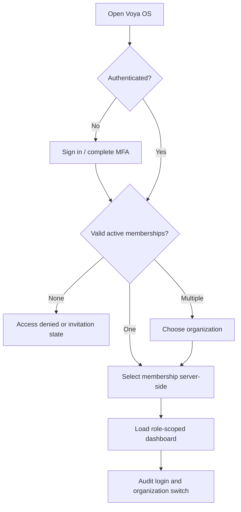
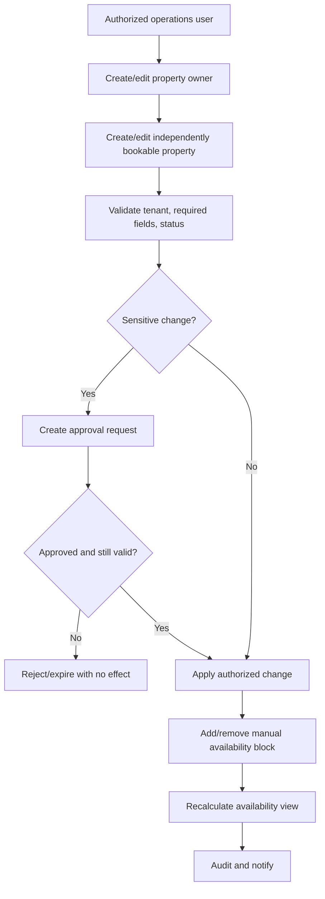
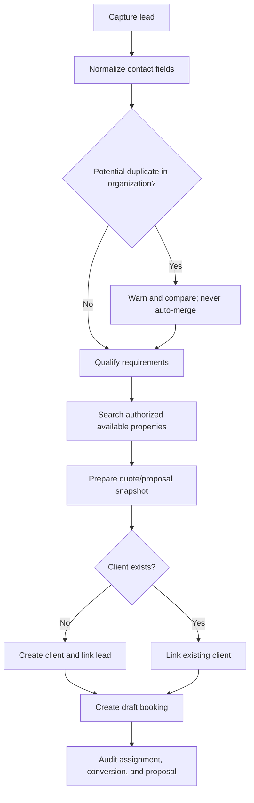
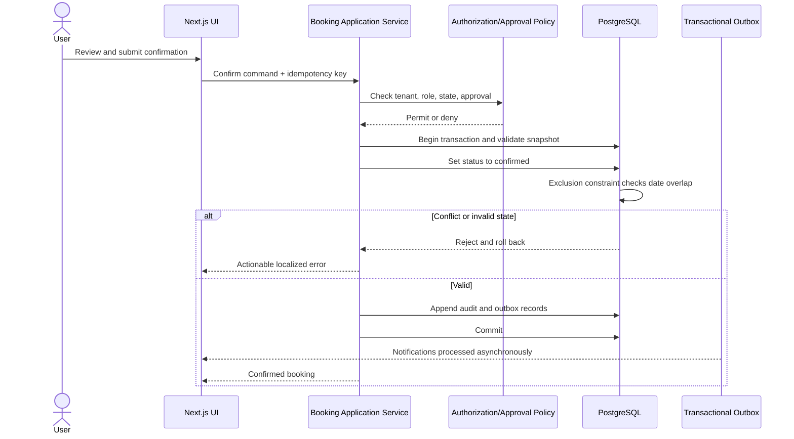
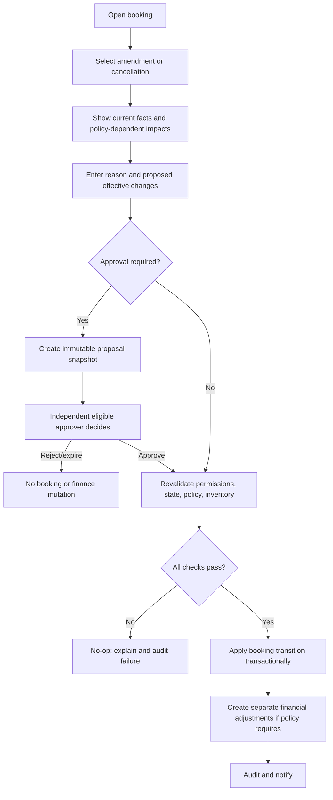
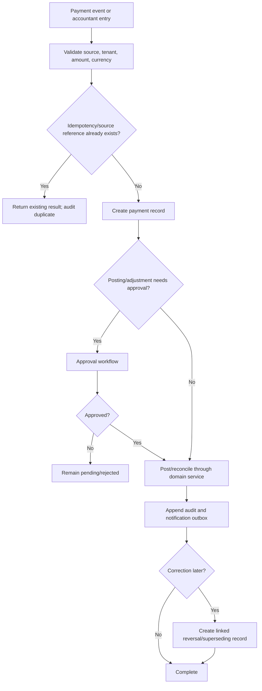
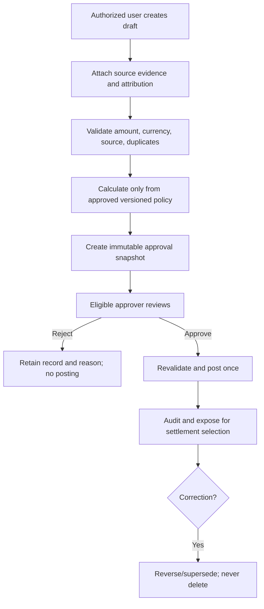
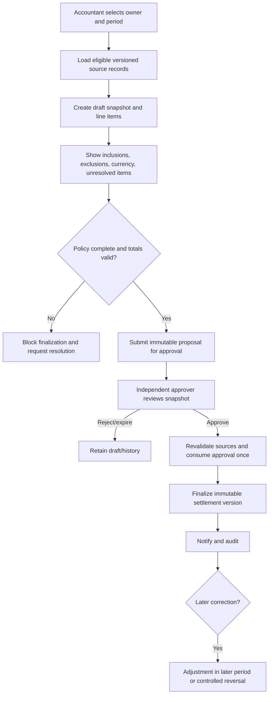
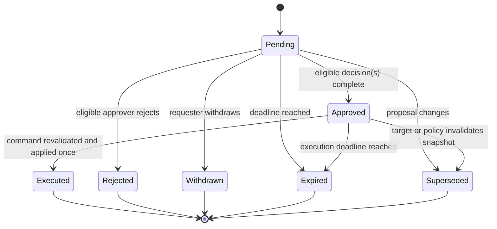
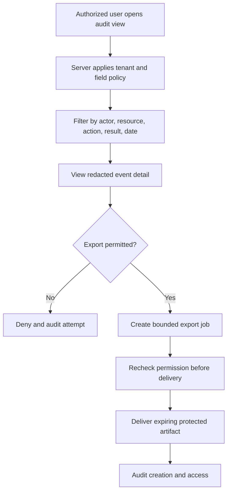

# Voya OS User Flows

**Status:** Draft for review
**Related:** [PRD](./PRD.md), [Permissions](./PERMISSIONS.md), [AI agents](./AI_AGENTS.md)

All flows assume an authenticated user, an active organization derived from membership, server-side authorization, input validation, idempotency for retried commands, and audit coverage. Arabic RTL is the default presentation; English changes presentation, not business behavior.

## 1. Sign in and organization selection



Edge cases: expired/revoked invitation, suspended user, stale browser tab after role change, last-owner protection, session revoked during a command, and organization ID tampering.

## 2. Create or update a property and availability



Edge cases: owner reassignment after historical settlements, archive with future bookings, a block overlapping a confirmed stay, concurrent edits, and removal of a block referenced by an active workflow.

## 3. Lead to client to booking proposal



Edge cases: same person across different tenants, ambiguous phone normalization, changed price/availability after quote, missing consent, reassigned sales agent, and malicious text in lead notes.

## 4. Confirm a booking



Acceptance notes: adjacency is allowed; overlap is not. Approval never reserves inventory. The database is the final concurrency guard, and all derived effects commit atomically or not at all.

## 5. Amend or cancel a booking



Edge cases: booking changed after approval, requester or approver loses role, dates now conflict, repeated cancellation, unknown refund/commission outcome, or failure after an external provider call. Unknown financial effects must block automated execution and route to finance review.

## 6. Record and reconcile a payment



The product must not assume payment-provider behavior, allocation, fee, refund, chargeback, or exchange-rate rules before those policies are approved.

## 7. Record expense or commission proposal



If no approved calculation rule exists, the system may record a human-entered proposal with provenance but must not calculate or post it automatically.

## 8. Prepare and finalize owner settlement



Edge cases: source corrected while approval is pending, multiple currencies, ownership changed mid-period, reopened period, negative balance, partial payout, and duplicate finalization.

## 9. Approval lifecycle



## 10. AI-assisted workflow

```mermaid
sequenceDiagram
  actor User
  participant UI
  participant AI as AI Orchestrator
  participant Guard as Policy and Tool Gateway
  participant Domain as Domain Service
  participant DB as PostgreSQL
  participant Model as OpenAI Responses API

  User->>UI: Ask for assistance
  UI->>AI: Authenticated request in active organization
  AI->>Model: Minimized context + allowlisted tools
  Model-->>AI: Structured response/tool request
  AI->>Guard: Validate schema, budget, permission, risk
  alt Read-only permitted tool
    Guard->>Domain: Execute tenant-scoped query
    Domain->>DB: Read under policy/RLS
    DB-->>AI: Authorized result
  else Booking or financial change
    Guard->>Domain: Create proposal only
    Domain->>DB: Store proposal/approval request + audit
    DB-->>AI: Proposal ID; no source-of-record mutation
  else Denied or unsafe
    Guard-->>AI: Safe refusal/error
  end
  AI->>Model: Tool result if continuation is needed
  Model-->>UI: Labeled answer with sources/proposed effect
```

## 11. Audit review and export



## 12. Global failure behavior

- Authorization failures reveal no resource existence across tenant boundaries.
- Validation and conflict errors are localized, actionable, and safe; internal details and SQL errors are not exposed.
- Retried commands are idempotent. Timeouts return an indeterminate-safe response and let the client query command status.
- External notification or AI outages degrade independently; they do not corrupt or roll back committed core records.
- Every denied sensitive action and every failed critical mutation emits security/operational telemetry with redacted context.
