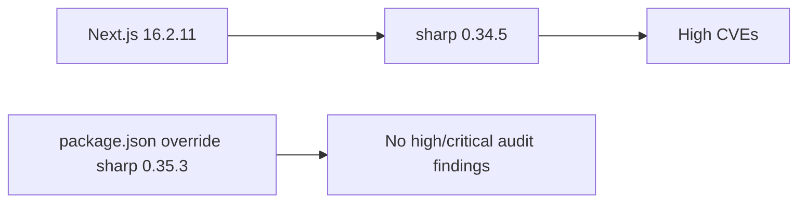

# ADR-001: Override Sharp Until Next Updates Its Optional Dependency

**Date:** 2026-07-22
**Status:** Accepted

## Context

`next@16.2.11` declares optional dependency `sharp@^0.34.5`. The audited `0.34.5` release carries high-severity inherited libvips findings. The automated `npm audit fix --force` recommendation would downgrade Next to `9.3.3`, which is neither safe nor compatible with this application.

## Decision

Use the declarative npm override `sharp: 0.35.3`. It satisfies the current Node 24 runtime requirement and is verified by lint, unit/component tests, database integration tests, E2E tests, and production build.

## Consequences

- The dependency graph is explicit and reproducible through `package-lock.json`.
- CI must retain `npm audit --omit=dev --audit-level=high` to detect regression.
- Revisit/remove the override when a supported Next release declares a secure Sharp range.
- The residual PostCSS moderate advisory remains tracked; force-downgrading Next is prohibited.

## Maintenance note — 2026-09-03 (Phase 0.4 scanner/preview hygiene)

- **Verified — checkout:** `next@16.3.3` now declares optional `sharp@^0.35.3`;
  the `sharp: 0.35.3` override satisfies the declared range exactly
  (`npm ls` reports `sharp@0.35.3 overridden` under `next@16.3.3`).
- The override is **retained** as an exact pin for reproducibility (it prevents
  silent float within `^0.35.x`), not removed: removal is not required by the
  revisit condition and would weaken determinism.
- **Verified — checkout:** lockfile (`lockfileVersion 3`) resolves
  `next 16.3.3` / `sharp 0.35.3` / `undici 7.29.0` / `postcss 8.5.26`
  (`postcss@8.5.26 overridden/deduped`, `undici@7.29.0 overridden`);
  `npm audit --omit=dev --audit-level=high` reports 0 vulnerabilities.
