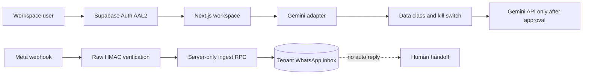

# ADR-010: Gemini, Meta WhatsApp, and workspace MFA release boundary

## Status

Accepted for the 2026-08 release branch. Provider delivery remains disabled by default.

## Decision

Voya OS keeps Supabase Auth and the server-owned application boundary. Every workspace session must reach Supabase AAL2 with a verified TOTP factor. Users without a factor are sent to `/security/mfa`; users with a factor but an AAL1 session must complete a fresh challenge.

AI uses a provider-neutral adapter with Gemini as the configured provider. Preview and test environments use a deterministic fake response and never call Gemini. Production customer data is rejected unless an explicit provider/data-processing approval flag is present. The adapter never receives credentials, arbitrary HTTP, SQL, or source-record mutation tools.

Meta WhatsApp is inbound-only in this slice. The route verifies the raw-body HMAC signature, bounds and parses text events, then calls a server-only Supabase RPC. The RPC resolves the channel, stores only provider-neutral message facts, deduplicates the provider event, and creates no outbound outbox event. Outbound delivery and AI auto-replies remain disabled until a separate human-handoff and worker review.

## Configuration

Secrets are managed only by the deployment provider. They must never be committed or logged. Preview uses synthetic data; production WhatsApp secrets are production-only. Gemini keys may exist in Preview and Production, but Preview still uses the fake adapter.

## Consequences

The first login for each workspace user includes a TOTP enrollment step. A missing provider secret produces a generic unavailable response rather than an unsafe fallback. The release can operate as a staff inbox and proposal-only AI surface without claiming external delivery.

## Rejected alternatives

- Email-only MFA: rejected because the workspace policy requires a second authenticator factor.
- Calling Gemini directly from a browser: rejected because it would expose provider credentials and bypass tenant/data policy.
- Treating a Meta webhook as an authenticated browser command: rejected because provider signatures and a server-only role are required.
