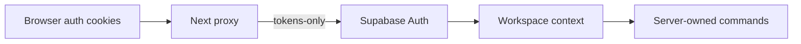

# ADR-011: Keep Supabase session cookies token-only

## Status

Accepted

## Context

The Supabase SSR session cookie contains a user object as well as access and refresh tokens by default. Its size crosses the cookie chunk boundary in the authenticated browser flow. When a refreshed token changed chunk shape, stale chunks could be combined with a newer chunk and the server treated the session as absent. The result was intermittent redirects to `/sign-in` during consecutive Server Actions.

## Decision

Configure every server-side Supabase SSR client (proxy, Server Actions, Route Handlers, and the auth callback) with `cookies.encode = "tokens-only"`. The server always asks Supabase for the current user with `auth.getUser()`; no application path relies on `getSession().user` from the cookie. The local authenticated browser fixture uses the same encoding.

## Consequences

Cookies are smaller and avoid unnecessary chunk churn while the user object remains provider-verified at request time. Code that needs a user must use `getUser()` or `getClaims()`, not trust a decoded session object. The proxy and server adapters must keep the encoding option aligned.

## Verification

The disposable Supabase + Playwright suite covers protected route sweeps, consecutive booking Server Actions, MFA AAL2, session refresh, and sign-out. A unit assertion protects the encoding contract in the proxy, route, and server adapters.
