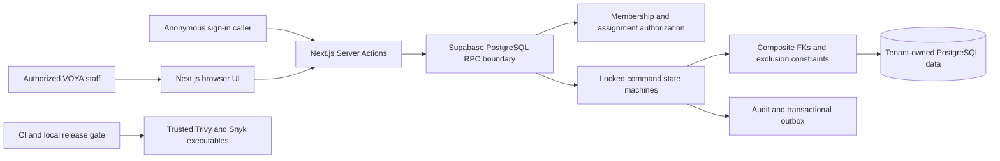

# ADR-013: Database-Enforced Production Security Invariants

**Status:** Accepted for human-reviewed merge; managed rollout gated
**Date:** 2026-08-03

## Context

The pre-auth, booking, CRM/WhatsApp, operations, and transport slices already use server-owned PostgreSQL RPCs, but several guarantees were still caller-controlled, checked only procedurally, or missing from the relational model. The critical failures were caller-selected authentication limits, expired booking approvals, cross-tenant references, unauthorized conversation notes, overlapping fleet allocations, unbound idempotency keys, and reversible terminal states. Fixes must remain compatible with a rolling application deployment and must not invent finance, provider, cancellation, or settlement policy.

## System and container boundary

The browser has no direct write grant to the affected tables. Identity comes from `auth.uid()` inside security-definer commands, while PostgreSQL constraints remain the final concurrency and tenant-integrity boundary.

## Options considered

1. **Application and UI validation only.** Rejected because direct RPC/SQL paths and concurrent transactions can bypass timing-dependent checks.
2. **Locked explicit RPCs plus declarative database constraints.** Selected. It is the smallest forward-compatible change that makes tenant, state, approval, and allocation invariants authoritative in PostgreSQL.
3. **New generic workflow engine and separate fleet-allocation ledger.** Strong long-term flexibility, but deferred because it expands the domain and migration surface without an approved workflow or dispatch policy.

## Decision

- Authentication rate-limit policy is selected by a fixed database scope. A two-argument RPC is canonical; the previous four-argument signature remains temporarily available only when its values exactly match the trusted policy.
- Every foreign key between two tenant-owned rows includes `organization_id`. Redundant unsafe single-column keys are removed only after the new constraints validate existing data.
- Booking request and confirmation idempotency is bound to organization, command, key, and booking. Confirmation locks the booking and approval, validates an exact approved snapshot, and requires `expires_at > clock_timestamp()`.
- Stale actionable booking approvals are locked and expired; one valid request is retained and historical duplicates are explicitly superseded. A `pending_approval` booking with no request can recover through the same command.
- Stay-event retries compare booking, event type, normalized notes, organization, and key before returning an existing result.
- A transport vehicle or driver occupies `[pickup_at, return_at)` while the request is `assigned` or `in_progress`. A null end is conservatively unbounded. `completed` and `cancelled` release resources. GiST exclusion constraints are the concurrency-safe arbiter.
- Transport and operations task status commands lock their row and accept only documented forward transitions. Terminal states cannot reopen through these commands.
- WhatsApp internal notes use the same owner/manager or assignment-based boundary as conversation reads and messages.
- Local scanner discovery accepts only a real executable resolved independently of shell aliases/functions, under a root-owned non-writable path, with validated version output. CI action pins remain unchanged.
- Rejected password and magic-link actions always clear their synchronous in-flight guard and expose an accessible retry state.

## Consequences

- The remediation is a forward-only migration. Old application instances continue to call the exact-policy legacy rate-limit signature; the migration must land before an application version that calls the narrow signature.
- Existing cross-tenant rows or overlapping active fleet allocations make the migration fail closed. The read-only preflight must return zero violations before an approved migration window.
- Adding unique and exclusion constraints takes locks and scans affected tables. The migration sets a five-second lock timeout and a fifteen-minute statement timeout; production-size rehearsal and an approved maintenance window remain mandatory.
- Reassigning a transport request back to a prior resource combination creates a distinct outbox event. An exact same-state retry remains a no-op after the locked row comparison.
- No finance, pricing, tax, payment, commission, provider-delivery, or cancellation policy is introduced.

## Rollout, rollback, and handover

1. Run the disposable previous-version upgrade, clean migration, database lint, concurrency, unit, production-render, browser, and scanner gates.
2. In a reviewed read-only managed session, run `supabase/tests/production_security_migration_preflight.sql`, inspect migration parity, and perform a dry run.
3. Take the approved managed backup and apply through the GitOps migration workflow. Do not use dashboard-only SQL.
4. Verify constraints, grants, representative tenant reads, approval expiry, and fleet conflict behavior before deploying the new application artifact.
5. Roll back the application to the prior immutable artifact if needed. Database reversal is a reviewed forward-fix migration or managed restore; applied history is never rewritten.

