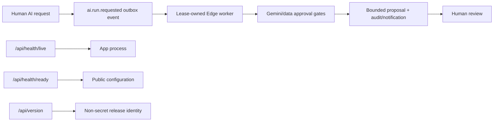

# ADR-019: Controlled AI execution and non-secret release probes

## Status

Accepted for V1 checkout; Gemini enablement, managed worker scheduling, and
staging/pilot evidence remain release gates.

## Context

The V1 AI screen could record requests but left every run queued. That was
honest, but it did not provide a complete human-reviewed suggestion workflow.
The application also needed a liveness probe, a configuration readiness probe,
and a non-secret release identity for deployment verification.

## Decision

Use the existing lease-owned `outbox-dispatch` Edge Function for
`ai.run.requested` events. The worker resolves the run through worker-only RPCs,
marks it running, calls the provider-neutral Gemini adapter, stores only a
bounded proposal result, and creates an in-app notification. Provider failures
are classified into retryable or permanent states; disabled/missing approval
conditions fail the run without mutating a source-of-record table. The allowed
AI agents remain sales, booking, and manager; finance stays disabled.

Expose `/api/health/live` for process liveness, `/api/health/ready` (with the
legacy `/api/health` alias) for public app configuration readiness, and
`/api/version` for `version`, `commit`, and `environment` only. These probes do
not query or claim managed Supabase health.

## Consequences

- Preview/test can use the deterministic fake Gemini path without a network
  call; production customer data requires the explicit approval flag.
- A provider result is review material only. No AI RPC can confirm bookings,
  change inventory, post finance, send WhatsApp, or approve its own proposal.
- The local suite proves RPC authorization, state transitions, result bounds,
  notification idempotency, and probe contracts. It does not prove managed
  secrets, schedule, provider account, backup/PITR, or deployed artifact parity.

## Verification

- `supabase/tests/ai_agent_center.sql`
- `src/lib/ai/execution-contract.test.ts`
- `src/lib/ai/gemini-runtime.test.ts`
- `src/app/api/health/live/route.test.ts`
- `src/app/api/health/ready/route.test.ts`
- `src/app/api/version/route.test.ts`
