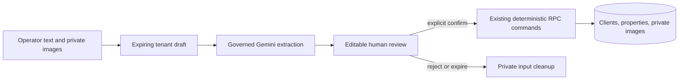

# ADR-020: Human-confirmed AI data entry

**Status:** Accepted for branch implementation; managed rollout gated
**Date:** 2026-08-22  
**Decision owners:** Voya OS product and engineering

## Context

Voya operators want to provide customer/property details and images to the AI
assistant and have the system prepare CRM/inventory records. The current AI
boundary is proposal-only, while clients, properties, and private property
images already have deterministic, tenant- and role-checked commands. Direct
model writes would bypass review, make hallucinations operational facts, and
create an unsafe binary upload path through the existing Server Action limit.

## Decision

Add an AI-assisted data-entry workflow that is explicitly staged as:

The model may return structured proposals only. It receives no database, HTTP,
credential, messaging, booking, payment, or mutation tool. The browser cannot
choose tenant or actor identity. Confirmation uses existing idempotent RPCs,
stable server-generated item keys, audit/outbox evidence, and resumable partial
progress. Image intake is private, bounded, authenticated, and separate from
the property-image registration boundary until the operator maps and confirms
it.

## Consequences

Positive:

- AI cannot silently create or alter operational records.
- Existing manual workflows remain the source of truth and continue to work
  when Gemini is disabled.
- Batch imports can be reviewed, corrected, retried, and audited.
- Private image handling avoids the known Server Action body-size failure.

Costs and limits:

- The flow has an extra review step and may produce partial batch progress.
- Draft/input retention and cleanup require explicit bounded lifecycle code.
- Facts without a current source-of-record field remain unresolved; this ADR
  does not add finance, client-document retention, or new property semantics.
- Live provider enablement remains separately gated by environment and the
  customer-data approval flag.

## Alternatives rejected

1. **Direct model mutation:** rejected because it violates the AI proposal and
   server-owned command boundary.
2. **Browser direct table/storage writes:** rejected because it bypasses tenant,
   role, audit, and private-storage controls.
3. **Synchronous Server Action with multipart images:** rejected because the
   existing Next.js Server Action body limit already caused local uploads to
   fail above 1 MB.
4. **Automatic duplicate merge:** rejected because the current CRM policy only
   provides warnings and does not authorize merge semantics.

## Supersession

This ADR should be superseded if Voya intentionally adopts an independently
authorized workflow engine or changes the policy from human-confirmed proposals
to autonomous source-record mutation. Such a change requires a new security
review and explicit product approval.

## Implementation evidence

- Checkout migration: `supabase/migrations/20260822121522_ai_data_entry_drafts.sql`
- Checkout SQL proof: `supabase/tests/ai_data_entry.sql`
- Checkout security review: `docs/SECURITY_REVIEW_AI_DATA_ENTRY.md`
- Managed Supabase and live customer-data execution remain unverified.
