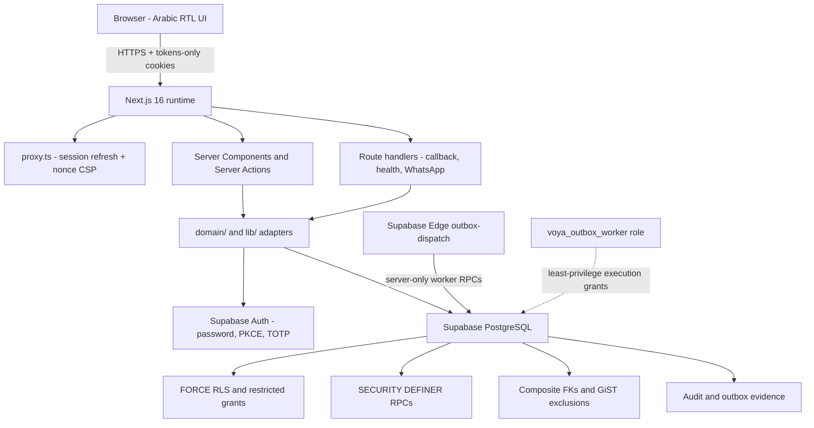
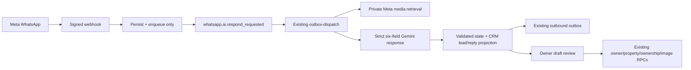
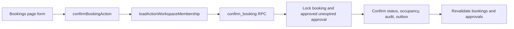
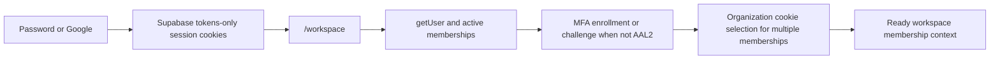

# Architecture (checkout implementation)

**Last verified:** 2026-08-27
**Truth plane:** checkout implementation; managed deployment and provider execution require separate dated evidence.  
**Shape:** Single-app **modular monolith** (Next.js App Router + Supabase PostgreSQL/Auth). Not a monorepo, not microservices.

> Note: `docs/ARCHITECTURE.md` is a broader design draft (still labels OpenAI, aspirational finance modules). **This file** reflects the checkout runtime shape, not managed deployment or live provider execution.

## System components

## Request patterns

### Authenticated workspace read

1. `proxy` refreshes Supabase session cookies.
2. Page calls `requireWorkspaceMembership([roles?])`.
3. Context loads user via `auth.getUser()`, active memberships, MFA AAL2, org cookie.
4. Data loaded with user-scoped client `rpc(...)` (preferred) or tightly scoped select.

### Authenticated command

1. Server Action validates form input.
2. `loadActionWorkspaceMembership()` — no ready membership ⇒ deny.
3. Optional app-level role gate (e.g. transport/fleet).
4. `createServerSupabaseClient().rpc(<command>, { p_organization_id: membership.organizationId, ... })`.
5. RPC re-checks `auth.uid()` + active membership + role + state machine.
6. Same transaction: mutate + audit (+ outbox when defined).
7. Map Postgres codes to Arabic UI states; revalidate paths.

### Public / privileged edges

| Surface | Trust model |
|---|---|
| `/sign-in` actions | Origin from `VOYA_APP_URL`; rate limit RPC; no service role |
| `/auth/callback` | PKCE/token_hash exchange; membership redirect only |
| `/api/health/live` | Liveness only; no provider dependency |
| `/api/health/ready` and `/api/health` | Application readiness: public-config validation plus the bounded service-role Supabase dependency probe from ADR-021; no secrets or provider details are exposed |
| `/api/version` | Non-secret release identity (`version`, `commit`, `environment`) |
| `/api/webhooks/whatsapp` | Meta signature + bounded service-role ingest/enqueue only; it never waits for Gemini |
| Outbox claim/complete/fail | Not granted to `authenticated`/`anon` |

## Frontend architecture

- **App Router** pages under `src/app/workspace/*` are thin: membership gate + load + shell + feature page.
- **Features** in `src/features/*` own UI and presentation types.
- **Design C shell** (`workspace-shell.tsx`) owns role-filtered navigation.
- Default locale Arabic RTL via localization domain helpers and layout.

## WhatsApp AI Phase 1 flow

The webhook is deliberately fast and does not call Gemini. The worker owns
media retrieval and AI execution under the existing outbox lease. Client facts
may update the existing CRM lead by a conversation-scoped idempotency key;
owner facts stay in `whatsapp_conversations.structured_state` until staff
confirmation creates or links operational records.

## Backend architecture

There is no separate API package. “Backend” = Server Actions + Route Handlers + PostgreSQL RPCs.

Layering in practice:

| Layer | Location | Owns |
|---|---|---|
| HTTP/UI boundary | `src/app/**` | session entry, form parsing, redirects |
| Feature policy/UI | `src/features/**` | workspace context, forms, dashboards |
| Domain pure rules | `src/domain/**` | stay overlap, MFA assurance, AI tool grants |
| Adapters | `src/lib/**` | Supabase clients, CSP, rate limit, Gemini, Meta |
| Source of record | `supabase/migrations/**` | schema, RLS, commands, concurrency |

## Data flow (booking confirm example)

Authoritative conflict control is PostgreSQL exclusion on confirmed bookings **and** the `property_occupancies` ledger (ADR-002), not UI prechecks.

## Auth flow (summary)

Details: `docs/AUTH_FLOW.md` + `src/features/auth/*` + ADR-010/011.

## Background work

- `outbox_events` table + `claim_outbox_events` / complete / fail / purge exist.
- Worker role `voya_outbox_worker` is the intended consumer.
- Source-only `supabase/functions/outbox-dispatch/index.ts` claims invitation email, manual WhatsApp, WhatsApp AI, and controlled AI events. It uses a five-minute lease and a maximum batch of 20.
- Resend, Meta, and Gemini calls are all fail-closed behind provider/data/human-handoff flags. Managed scheduling, secrets, and delivery remain release gates.

## Deployment / CI (discovered)

- App: Next.js production build; Vercel-oriented env (`VERCEL_ENV` used by Gemini config).
- CI: `.github/workflows/quality.yml` — lint, unit coverage, disposable DB tests, Playwright e2e, production render checks, auth-local e2e, npm audit, Snyk, Trivy.
- DB tests refuse non-local non-`*_test` databases (`scripts/test-database-foundation.mjs`).

## What not to assume from older architecture text

| Claim in old docs | Current reality |
|---|---|
| OpenAI Responses API | Gated Gemini adapter/runtime path in checkout (`src/lib/ai/gemini-runtime.ts`) |
| Finance module tables | Not migrated |
| Browser-heavy Supabase writes | Rejected; grants revoked / RPC-owned |
| Separate worker container always running | Logical design only |
