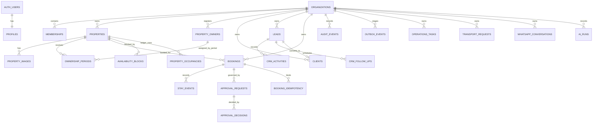

# Data model (implemented)

**Last verified:** 2026-08-13
**Checkout authority:** `supabase/migrations/*.sql` (not `docs/DATABASE.md` aspirational catalog). Managed schema/function state requires dated provider evidence and is tracked separately in [CURRENT_STATE.md](./CURRENT_STATE.md).

## Conventions (verified in migrations)

- UUID primary keys (`gen_random_uuid()` / pgcrypto).
- Tenant column `organization_id` on business tables.
- Composite uniqueness `(organization_id, id)` used to enable tenant-qualified FKs.
- Timestamps `timestamptz` UTC defaults.
- Stay/block dates as `date` with half-open ranges.
- Optimistic `version` on some mutable aggregates (properties, clients, bookings).
- Append-oriented evidence: `audit_events`, stay events, consent events, message events.
- FORCE RLS common on tenant tables; many command tables revoke broad grants and expose RPC only.

## Entity map (tables that exist)

## Core entities

### Identity & tenancy

| Table | Owns | Notes |
|---|---|---|
| `profiles` | display name, locale | Linked to `auth.users`; not a role store |
| `organizations` | tenant root | slug unique; status active/suspended; default `Africa/Cairo` |
| `organization_memberships` | role + status per user/org | Unique `(organization_id, user_id)` |

### Supply

| Table | Owns |
|---|---|
| `property_owners` | managed owner party records, contact methods, notes, and lifecycle/version |
| `property_ownership_periods` | time-bounded owner assignment, primary-contact marker, idempotency key |
| `properties` | bookable unit code/name/timezone/location/capacity/status/version |
| `property_images` | private object metadata, MIME/size/dimensions, lifecycle, and tenant-qualified storage path |
| `availability_blocks` | non-bookable date ranges + reason |
| `property_occupancies` | **implementation detail** unified occupancy ledger |

### Demand & booking

| Table | Owns |
|---|---|
| `leads` | V1 sales pipeline rows with contact/request facts, duplicate warning inputs, and conversion link; legacy title-only rows remain readable |
| `clients` | canonical clients in org with contact facts, source lead, lifecycle/version, and duplicate warning inputs |
| `crm_activities` | append-only human activity timeline for leads |
| `crm_follow_ups` | human-owned pending/completed follow-up queue for leads |
| `bookings` | stay request/state machine |
| `booking_stay_events` | check_in/check_out facts (unique per type) |
| `booking_command_idempotency` | lifecycle command idempotency binding |

### Governance & platform

| Table | Owns |
|---|---|
| `approval_requests` / `approval_decisions` | maker-checker evidence |
| `audit_events` | append-only action evidence |
| `outbox_events` | transactional side-effect staging |
| `notifications` | in-app notification rows |

### Operations extensions

| Table | Owns |
|---|---|
| `operations_tasks` | ops work items |
| `fleet_vehicles` / `fleet_drivers` / `transport_requests` | transport ops |

### CRM / WhatsApp / AI

| Table | Owns |
|---|---|
| `crm_contact_methods` / `crm_consent_events` | contact + consent facts |
| `whatsapp_*` | staff inbox channel/conversation/message/note |
| `ai_runs` / `ai_tool_calls` | governed AI run evidence |
| `auth_rate_limit_buckets` | sign-in rate limiting |

## Important constraints (architecturally meaningful)

1. **`bookings_no_confirmed_overlap`** — GiST exclude confirmed stays per org+property.
2. **`property_occupancies` exclusion** — bookings and blocks share one conflict domain.
3. **Tenant-qualified FKs** — e.g. booking→property `(organization_id, property_id)`.
4. **Stay validity** — `check_in < check_out`.
5. **Idempotency** — unique keys scoped by organization (and command/booking where added).
6. **Stay event once** — unique `(organization_id, booking_id, event_type)`.
7. **Transport active allocation exclusions** — prevent double-booking vehicle/driver windows.
8. **Property image boundary** — private bucket metadata is tenant-qualified; active images are limited to 20 per property and 10 MiB each, with MIME/path checks.
9. **Owner assignment periods** — half-open date ranges cannot overlap for the same organization/property.
10. **CRM activity immutability** — lead activities cannot be updated or deleted after insertion.
11. **CRM conversion uniqueness** — one organization/source lead maps to at most one client; retries return the same client.
12. **CRM duplicate policy** — normalized phone/email produce warnings only; no automatic merge is performed.
13. **Booking client eligibility** — new booking writes reject archived clients at the database trigger boundary; existing historical bookings remain readable.

## Command/read RPC pattern

In ordinary authenticated user flows, mutations and many reads are **functions**
invoked through the server boundary, not direct table DML from the browser role.
Privileged webhook, service-role, and worker paths use separate trust
boundaries; direct browser table writes remain deny-by-default.

Examples: `create_booking_draft`, `confirm_booking`, `create_lead_v1`, `create_lead_activity_v1`, `create_lead_follow_up_v1`, `convert_lead_to_client_v1`, `create_property_v1`, `update_property_owner_v1`, `assign_property_owner_v1`, `list_property_images_v1`, `ingest_whatsapp_webhook_event`, `claim_outbox_events`, `consume_auth_rate_limit`.

Grants are explicit: typically `TO authenticated` for staff RPCs; service_role or worker role for privileged paths; `anon` largely revoked except intentional pre-auth limiter.

## Not present (despite older DATABASE.md diagrams)

No migrated tables for: `payments`, `expenses`, `commissions`, `financial_adjustments`, `owner_settlements`, `booking_versions` commercial snapshots, `role_policies`, `approval_policies` config tables, `notification_deliveries`.

Treat those as **future design**, not current schema.

## How to evolve the model

1. Add SQL migration under `supabase/migrations/`.
2. Add/adjust `supabase/tests/*.sql`.
3. Wire Server Action/page only after RPC grants and role checks exist.
4. Update this document’s entity list and DOMAIN_RULES/SECURITY if invariants change.
