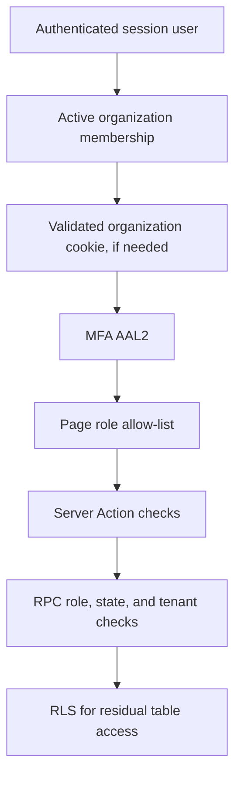

# Security boundaries

**Last verified:** 2026-08-27
**Local checkout / policy review:** 2026-08-27
**Managed Supabase snapshot:** 2026-08-05 (read-only evidence supplied for this pass)  
**Priority:** highest for agent work. Breaking these is a release blocker.

The invariant sections describe the approved checkout target and security
contract. The managed snapshot below is a separate runtime fact. Do not treat
the target contract, a dirty migration, or an accepted ADR as proof that the
managed database currently matches it.

## Write trust boundaries

Ordinary authenticated browser mutations flow through Server Actions and
authorized RPCs. Privileged webhook, service-role, and worker flows use
separate narrowly scoped trust boundaries. Direct browser table writes remain
deny-by-default unless a specifically documented exception exists; no client-
controlled identity, role, or organization may cross those boundaries.

## Non-negotiable invariants

1. **Browser writes are deny-by-default.** No trusting client-supplied user id, role, organization, or membership.
2. **Tenant isolation is server + database enforced.** `organization_id` must be derived from authenticated active membership, then re-checked in RPC/RLS.
3. **FORCE RLS** on tenant tables; policies are defense in depth, not the only control.
4. **Critical mutations are SECURITY DEFINER RPCs** with fixed `search_path`, membership/role/state checks, and focused grants.
5. **Service role bypasses RLS** — server-only, never `NEXT_PUBLIC_*`, never shipped to browser.
6. **Confirmed occupancy correctness** is a database constraint problem (GiST + occupancy ledger), not a UI race.
7. **Audit/outbox evidence** for sensitive commands must remain attributable and non-destructive.
8. **Do not invent finance/cancellation/provider policy** to “complete” a flow.
9. **Never commit, log, or print secrets** (API keys, service role, webhook secrets, raw tokens).
10. **Workspace requires MFA AAL2** with verified TOTP before tenant data.

## Authentication

| Concern | Implementation |
|---|---|
| Identity provider | Supabase Auth |
| Password sign-in | Server Action → `signInWithPassword` |
| Magic link | Server Action OTP + `/auth/callback` PKCE/token_hash |
| Session cookies | `@supabase/ssr` with `encode: "tokens-only"` (ADR-011) |
| User verification | `auth.getUser()` — do not trust cookie-decoded user object alone |
| App origin | `VOYA_APP_URL` / `resolveApplicationOrigin` — not client-chosen redirect targets |
| Rate limiting | Checkout target: narrow two-argument `consume_auth_rate_limit` with database-owned policy (ADR-009/013); the trusted application bucket key is HMAC-SHA256-derived with server-only `AUTH_RATE_LIMIT_HMAC_SECRET`. Rotating that key starts fresh counters. The local compatibility candidate restores the four-argument rolling wrapper with fixed values only; the managed snapshot remains unrepaired and is still P1. |
| MFA | enrollment/challenge via `/security/mfa`; policy in `mfa-policy.ts` (ADR-010) |

Failure posture: missing config fails closed to signed-out / unavailable, not open access.

## Authorization stack

**Dangerous anti-patterns for agents:**

- Adding `from(table).insert/update/delete` from browser or loosely privileged clients
- Accepting `organization_id` from form body without membership bind
- Granting `anon` execute on staff RPCs
- Using service role in Server Components for normal user reads
- Weakening maker-checker (self-approve)
- “Temporarily” disabling MFA or RLS in shared environments

## Managed Supabase security snapshot (verified 2026-08-05)

The managed environment currently exposes both of these overloads:

- `public.consume_auth_rate_limit(text, text)`;
- `public.consume_auth_rate_limit(text, text, integer, integer)`.

Both are `SECURITY DEFINER`, and both are executable by both `anon` and
`authenticated`. The four-argument overload allows the caller to supply `p_limit` and
`p_window_seconds`. Therefore the managed environment must not be described
as having fully database-owned or caller-independent rate-limit policy until
the legacy overload/grant discrepancy is remediated and re-verified.

The managed environment also contains
`public.bootstrap_personal_workspace(uuid)`. It is `SECURITY DEFINER` and
`authenticated` currently has `EXECUTE`. The function can create the caller's
profile, organization, owner membership, and audit evidence. This is present
in managed Supabase even though the function and self-service application flow
are branch-only relative to the current checkout. Deployment and product
policy alignment remain open.

These facts are managed-environment evidence only; they do not imply that the
current application artifact calls the bootstrap function or that the
checkout migration inventory is deployed.

The checkout now contains a pending forward repair migration after the exact
managed `20260803092522_password_signup_rate_limit` history. The repair has
been verified only on the disposable local database; no managed mutation was
performed.

## RLS and grants

- Early foundation: SELECT grants to `authenticated` + membership policies on core tables.
- Later slices: many tables have **no policies** and are RPC/service owned; PostgREST table grants revoked for those (managed version `20260803090304_revoke_postgrest_table_grants.sql`; local filename reconciliation is a working-tree candidate).
- Checkout remediation intent is to revoke public execution broadly and retain
  only the narrow pre-auth rate-limit path. Managed evidence currently shows
  both rate-limit overloads executable by both `anon` and `authenticated`; this
  is a P1 discrepancy, not proof that the target grant posture is deployed.
- Outbox claim/complete/fail **not** for `authenticated`.
- WhatsApp ingest granted to **service_role**; worker context/media/result helpers are granted only to `voya_outbox_worker`/`service_role`; browser roles receive only tenant-scoped reads, AI toggle, and confirmation claim/finalization RPCs.

When changing grants: update SQL tests (`postgrest_table_grants.sql`, domain SQL tests).

## Privileged operations

| Operation | Who |
|---|---|
| Normal staff commands | `authenticated` via user JWT + RPC |
| WhatsApp webhook ingest | Route handler + `SUPABASE_SERVICE_ROLE_KEY` + signed Meta payload |
| Outbox processing | `voya_outbox_worker` DB role (not app user) |
| Auth rate limit consume | Checkout target: `anon`/`authenticated` via the narrow two-argument RPC. Managed snapshot: both overloads are `SECURITY DEFINER` and executable by both `anon` and `authenticated`; the legacy four-argument overload remains a P1 discrepancy pending remediation. |

## Public / anonymous surfaces

- Marketing/public home and sign-in UI
- `/api/health`
- `/api/webhooks/whatsapp` (authenticated by Meta signature, not user session)
- Auth callback

Everything under `/workspace/*` is membership-gated and cache-sensitive (`test:production` asserts no shared caching of protected renders).

## Webhook trust

WhatsApp POST:

1. Require `META_WHATSAPP_APP_SECRET`
2. Bound body size
3. Verify `x-hub-signature-256` over **raw body**
4. Parse provider-neutral events
5. Service-role RPC `ingest_whatsapp_webhook_event_v1` with dedupe and enqueue-only behavior

GET verify uses `WHATSAPP_VERIFY_TOKEN`. Misconfiguration returns generic 503/403 — no secret leakage.

The worker retrieves image bytes only with the server-side
`META_WHATSAPP_ACCESS_TOKEN`, restricts metadata/download hosts to the
allowlisted Meta domains, enforces a 10 MiB stream ceiling, checks the declared
MIME against bytes/signature, and stores only in private `ai-intake`. The staff
preview route rechecks the tenant conversation/media RPC before issuing a
five-minute signed URL.

## AI security

The following Gemini statements describe checkout capability and safety gates;
they do not assert live managed provider execution.

- Tool allowlist is code-defined and role/agent scoped.
- Effects are read/proposal only in current registry.
- Gemini runtime:
  - kill switch `GEMINI_ENABLED`
  - preview/test synthetic-only (no live customer calls)
  - customer data requires `GEMINI_CUSTOMER_DATA_APPROVED`
- outbound WhatsApp AI requires additional flags
- AI must not become source of record or bypass approvals.

The WhatsApp response parser accepts exactly six top-level fields and bounded
facts/actions; arbitrary SQL, HTTP, RPC, tool, or database commands are
rejected. The outbox worker alone calls Gemini and applies its validated result.
`client_sales` can update the existing CRM lead by a conversation-scoped
idempotency key without merging people. `owner_onboarding` writes only the
conversation draft; an authenticated inventory role must confirm before the
existing owner/property/ownership/property-image commands run.

### Human-confirmed data entry

The checkout now contains a separate `data_entry` proposal boundary. Authorized
operational roles may create a tenant-scoped draft and upload bounded JPEG/PNG/WebP
inputs through `/api/workspace/ai/data-entry/inputs`. The route uses the verified
workspace membership and server-only service role; it returns only an opaque input
ID and never a public or service-role URL.

The outbox worker downloads private inputs server-side and sends them to Gemini
only when the environment is non-synthetic and
`GEMINI_CUSTOMER_DATA_APPROVED=true`. Source text/images are untrusted content;
the model has no mutation tools and its output must pass schema validation. A
human-edited confirmation then calls existing role-checked, idempotent CRM,
property, and property-image RPCs. Every authenticated AI data-entry RPC repeats
the MFA boundary in PostgreSQL through `require_ai_data_entry_aal2_v1`, so a
password-only (`aal1`) JWT cannot bypass the Server Action. The non-AAL2
implementations are revoked from authenticated callers; heartbeat, progress,
mapping, archival, and finalization helpers remain separate service-role-only
worker boundaries. AI-confirmed property-image registration uses the atomic
`apply_ai_data_entry_property_image_v1` RPC, which requires the exact
confirmation execution token, is granted only to `service_role`, and registers
the source-of-record row and maps its intake input in one transaction; the
application does not issue a second legacy mapping call.
Draft version checks, stable per-item keys, audit evidence, partial progress, and
reject cleanup protect retries and failure paths. No managed migration, bucket,
worker schedule, or live customer-data provider call is proven by this checkout.

## Session concurrency guidance (local/manual testing)

- **Do not reuse the same user for browser login and concurrent RPC seeding.** Supabase issues a new `refresh_token` on each `signInWithPassword`; concurrent `signInWithPassword` calls with the same email can rotate the token and invalidate the browser's `tokens-only` cookie session, forcing an MFA re-challenge. For local manual seeding, use a dedicated seeder account (e.g., `manager-...@voya.invalid` or `seeder@...`) distinct from the logged-in browser user, or seed via `psql` as `postgres` (which bypasses Auth and does not touch sessions).
- Verified during 2026-08-29 manual Agent run: seeding 8 RPCs with the same `agent-...@voya.invalid` that was logged in via `http://127.0.0.1:3102` caused two redirects to `/sign-in`/`/security/mfa?reason=challenge`; switching the RPC seeder to a separate `manager-...@voya.invalid` eliminated the flaps.

## CSP / HTTP hardening

- Nonce CSP built in `proxy.ts` / `content-security-policy.ts` (ADR-009)
- Security headers in `next.config.ts` (nosniff, frame deny, referrer, permissions-policy)
- Server Actions `allowedOrigins` derived from `VOYA_APP_URL`

## Secrets inventory (names only)

| Name | Use |
|---|---|
| `NEXT_PUBLIC_SUPABASE_URL` | public project URL |
| `NEXT_PUBLIC_SUPABASE_PUBLISHABLE_KEY` | browser/server publishable key |
| `VOYA_APP_URL` | trusted origin |
| `SUPABASE_SERVICE_ROLE_KEY` | server privileged client |
| `AUTH_RATE_LIMIT_HMAC_SECRET` | server-only HMAC key for pre-auth rate-limit bucket derivation; never browser-exposed or logged |
| `WHATSAPP_VERIFY_TOKEN` / `META_WHATSAPP_APP_SECRET` | Meta webhook |
| `META_WHATSAPP_ACCESS_TOKEN` / `META_GRAPH_API_VERSION` | server-only Meta media retrieval and gated outbound |
| `GEMINI_API_KEY` + approval/enable flags | AI provider |
| CI: `SNYK_TOKEN` | scanning |

## Security-sensitive files to re-read before changes

- `src/features/auth/*`
- `src/lib/supabase/*`
- `src/lib/security/*`
- `src/proxy.ts`
- `src/app/api/webhooks/whatsapp/*`
- `src/domain/auth/mfa-policy.ts`
- `src/domain/ai/tool-policy.ts`
- Latest migrations from `20260803*` and ADR-013
- `scripts/security-scan.sh`

## Related ADRs

ADR-002 occupancy, ADR-003 auth context/outbox, ADR-009 rate limit/CSP, ADR-010 MFA/Gemini/Meta, ADR-011 tokens-only cookies, ADR-013 DB-enforced production security invariants, ADR-022 WhatsApp AI Phase 1.
