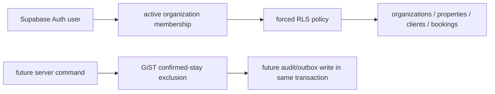

# Tenancy and Booking Database Foundation — Implementation Plan

> **Execution:** implement this plan on `feature/foundation-dashboard`, beginning from commit `83e951e`.

## Goal

Create the first declarative Supabase/PostgreSQL foundation that makes tenant isolation and confirmed-stay conflict prevention enforceable in the database. This slice deliberately excludes financial workflows, approval policy thresholds, AI tools, notifications, and application mutations.

## Guardrails

- The authenticated client gets no direct `INSERT`, `UPDATE`, or `DELETE` access to bookings. Critical commands will be introduced through reviewed server-side adapters in a later slice.
- Every tenant-owned row has a non-null `organization_id`; tenant-qualified composite foreign keys prevent cross-tenant references.
- RLS is enabled and forced on every table in scope. Policies require an active membership for `auth.uid()`; no browser-controlled organization setting is trusted.
- `bookings` represents property-local `[check_in, check_out)` dates. A PostgreSQL GiST exclusion constraint rejects overlaps only when a row is `confirmed`, so adjacent stays are valid.
- This slice stores no payment/bank/card data and creates no financial tables. It must not invent financial approval or calculation rules.
- Migrations are forward-only and declarative. No destructive down migration is supplied.

## Design

### Schema scope

1. Extensions and common timestamp helpers.
2. `profiles`, `organizations`, and `organization_memberships`, with stable text check constraints for the approved role/status identifiers.
3. `properties`, `clients`, and `bookings` as the minimal operational roots. `properties` and `clients` have tenant-qualified unique keys. `bookings` has tenant-qualified foreign keys to both, a date check, an idempotency key, optimistic `version`, and the partial GiST exclusion constraint.
4. Safe `SECURITY DEFINER` helpers use a pinned `search_path`; they provide only active-membership checks for RLS. They do not authorize writes or execute commands.
5. Explicit RLS policies allow only membership-scoped reads in this initial migration. Writes are absent by design.

### Test design

- Unit tests expand the pure TypeScript booking rules with idempotency and tenant-qualified reference fixtures only when behavior is introduced.
- A PostgreSQL integration SQL test bootstraps a minimal `auth.uid()` shim for an ephemeral container, applies the migration, and proves:
  - an active same-tenant user can read only its tenant rows;
  - inactive and cross-tenant users read nothing;
  - invalid stays fail;
  - an adjacent confirmed stay succeeds;
  - a concurrent-equivalent overlapping confirmed insert fails with `23P01`;
  - draft/pending booking rows may overlap because they reserve no inventory;
  - cross-tenant property/client references fail.
- A Node test runner starts PostgreSQL only from an explicit `DATABASE_URL`; local development uses the documented Docker command. CI will provide the service. It does not target production or a developer's default database.

## Files

| File | Responsibility |
|---|---|
| `supabase/migrations/20260721000100_tenancy_booking_foundation.sql` | Schema, RLS, grants, constraints, indexes |
| `supabase/tests/tenancy_booking_foundation.sql` | SQL assertions and seed setup for ephemeral PostgreSQL |
| `scripts/test-database-foundation.mjs` | Explicit-URL migration/test runner with safety checks |
| `package.json` | `test:db` command and required PostgreSQL client dependency |
| `.github/workflows/quality.yml` | Ephemeral PostgreSQL integration job plus lint/unit/E2E/build/security gates |
| `docs/DATABASE_FOUNDATION.md` | Operational test instructions, assumptions, extension/runtime constraints |

## Execution steps

- [x] Write the database integration assertion script first and run it red because the migration does not yet exist.
- [x] Add the schema migration with tenant-qualified relational integrity, RLS, and booking exclusion constraint.
- [x] Add a guarded Node runner and package script; run against an explicitly created disposable PostgreSQL container.
- [x] Add the CI workflow with pinned actions, npm lockfile install, unit/UI/E2E/build/database checks, audit, and container scan.
- [x] Document migration assumptions and the remaining production decisions.
- [x] Run fresh lint, unit coverage, database integration test, E2E, build, audit, and scan evidence; commit only after all available gates pass.

## Decisions deferred

- Exact booking-confirmation roles and when approval is required.
- Availability-block locking / unified occupancy design.
- Organization signup/bootstrap and last-owner lifecycle.
- MFA, session assurance, invitation flow, audit/outbox integration.
- Finance schema, accounting policy, currency, commission, settlement, and approval thresholds.
