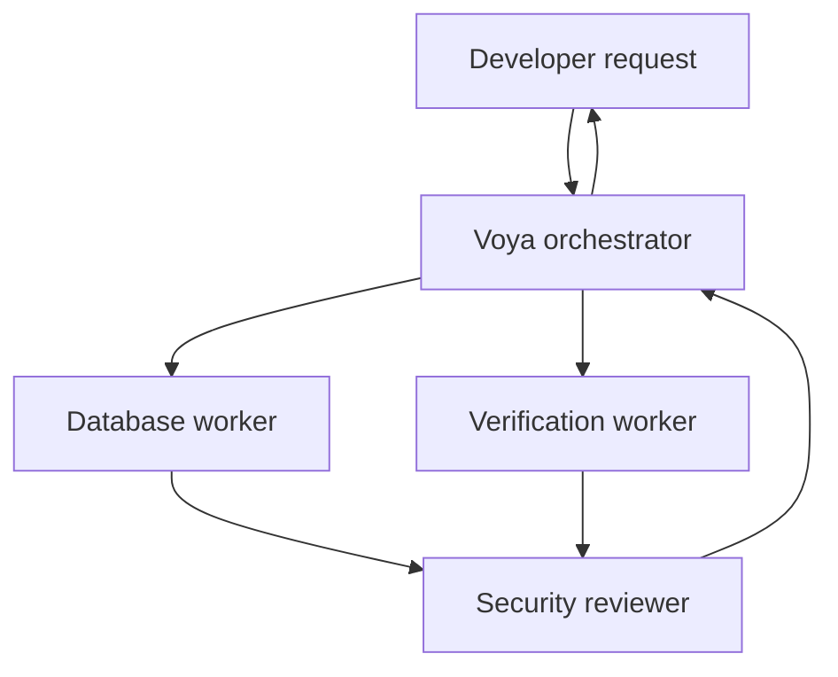
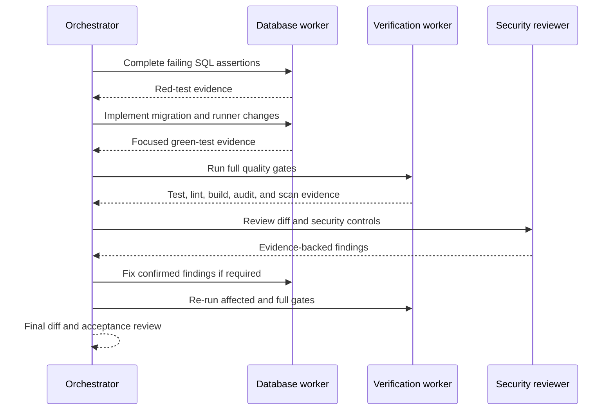

# Project-Scoped Codex Development Agents Design

**Status:** Approved design pending written-spec review
**Date:** 2026-07-22
**Scope:** Codex development workflow for Voya OS; no runtime product AI

## AI Task

Create a project-scoped Codex team that can execute bounded Voya OS engineering plans while preserving the repository's production, test-first, and security constraints. The immediate job is to finish the existing Property and Availability Foundation plan.

The orchestrator may decompose work, assign exclusive file ownership, wait for workers, and synthesize results. Workers may edit only their assigned files. No agent may deploy, alter production infrastructure, use production credentials, or perform destructive database operations.

## Options Considered

### Option 1: Orchestrator and one general worker

This has the lowest configuration and token cost, but combines implementation, verification, and review responsibilities. It provides insufficient independence for the repository's security-review requirement.

### Option 2: Four specialized roles

Use an orchestrator, database worker, verification worker, and read-only security reviewer. This provides clear ownership and independent review without excessive fan-out. This is the selected option.

### Option 3: A worker for every application layer

Permanent frontend, backend, database, DevOps, test, documentation, and security agents would provide additional specialization. The current repository is too small to justify the coordination cost and increased risk of overlapping edits.

## Recommended Pattern

Use Codex project-scoped custom agents with bounded delegation. This is a development-time orchestration system, not an agentic runtime inside Voya OS.



The default concurrency limit is four threads and the nesting depth is one. The orchestrator owns decomposition and synthesis. Child workers cannot recursively create more workers.

## Agent Contracts

### Voya orchestrator

- Model: `gpt-5.6-sol`
- Reasoning effort: `xhigh`
- Responsibilities: interpret approved plans, define task order and file ownership, delegate independent work, preserve user changes, collect evidence, and decide whether the success criteria are satisfied.
- Prohibited behavior: direct production changes, unbounded delegation, accepting a worker's success claim without verification, or weakening a test or security control to obtain a passing result.

### Database worker

- Model: `gpt-5.6-terra`
- Reasoning effort: `high`
- Responsibilities: PostgreSQL and Supabase migrations, database integration tests, tenant-qualified constraints, RLS, grants, and database documentation assigned by the orchestrator.
- Prohibited behavior: production database access, destructive migrations, browser-role write grants, cross-tenant trust, or edits outside assigned files.

### Verification worker

- Model: `gpt-5.6-terra`
- Reasoning effort: `high`
- Responsibilities: execute focused and full verification, capture reproducible failures, inspect coverage, lint, builds, audits, and scanner output, and report evidence without modifying production behavior unless explicitly assigned a fix.
- Prohibited behavior: hiding failures, updating snapshots without review, weakening checks, or editing files owned by another active worker.

### Security reviewer

- Model: `gpt-5.6-sol`
- Reasoning effort: `xhigh`
- Sandbox: read-only
- Responsibilities: independently review tenant isolation, RLS, grants, foreign keys, concurrency, injection risks, error handling, logging, documentation, and test coverage. Findings require reproduction steps and a failing test or concrete verification command.
- Prohibited behavior: implementation edits, speculative findings without evidence, secret access, or production actions.

## Project Configuration

The implementation will add:

```text
.codex/
├── config.toml
└── agents/
    ├── voya-orchestrator.toml
    ├── database-worker.toml
    ├── verification-worker.toml
    └── security-reviewer.toml
```

`.codex/config.toml` will register all four roles and set `agents.max_threads = 4` and `agents.max_depth = 1`. Each agent file will contain a narrow description, model settings, and durable developer instructions. The security reviewer will use a read-only sandbox. Other agents inherit the parent session's permissions so a project file cannot silently expand authority.

Codex loads project-scoped agent configuration when a session starts. During the current session, workers will be launched with the same model and role instructions explicitly; future sessions can select the persisted custom roles directly.

## Immediate Execution Flow

The approved Property and Availability Foundation plan remains the source of implementation truth.



Only one implementation worker owns the database migration and integration-test files at a time. Verification and security review begin after a coherent implementation exists, avoiding write conflicts and false results from partially written migrations.

## Error Handling and Stop Rules

- A worker returns the exact failing command, relevant output, and suspected cause when blocked.
- Transient commands may be retried once. Persistent failures return to the orchestrator for diagnosis.
- Missing local infrastructure is reported separately from application failures; no production or ambiguous database URL may be used as a substitute.
- Security findings block completion until fixed or explicitly accepted by the user.
- Agents stop before external writes, deployments, destructive operations, credential changes, or material scope expansion.
- Existing uncommitted user files are preserved. Agents must not revert or overwrite unrelated work.

## Testing and Security

Agent configuration will be validated through TOML parsing and repository discovery checks. The database slice must include focused PostgreSQL integration coverage for tenant-qualified ownership, non-overlapping ownership periods, half-open availability ranges, cross-tenant rejection, and absence of authenticated writes.

Before completion, the orchestrator requires the full unit and integration suites, coverage, lint, E2E, production build, dependency audit, an available Trivy or Snyk scan, `git diff --check`, and an independent security review. Environment-dependent checks must be reported accurately rather than represented as passing when prerequisites are unavailable.

## Observability and Cost

The orchestrator retains concise summaries containing task ownership, commands executed, failures, fixes, and final evidence. Worker count is capped to control token and local-resource cost. Terra handles bounded implementation and verification; GPT-5.6 Sol handles orchestration and the higher-risk security judgment.

No application telemetry or OpenAI API billing is introduced because these agents run in the Codex development environment, outside the Voya OS runtime.

## Rollout and Rollback

The configuration is project-scoped and takes effect for trusted sessions started after it is added. Rollout begins with the current database plan and remains limited to four roles. If a role causes duplication or poor handoffs, its registration can be removed without changing application code or database state.

Rollback consists of reverting the `.codex` configuration files. Database migrations remain governed independently as forward-only artifacts and must not be rolled back destructively through the agent configuration.

## ADR-001: Use a Four-Role Project-Scoped Codex Team

### Context

Voya OS requires test-first implementation, independent security review, strict tenant isolation, and complete verification evidence. A general-purpose agent can perform these tasks, but combining implementation and approval in one role weakens review independence. Excessive specialization would increase context, token use, and file conflicts.

### Decision

Use four project-scoped Codex roles: orchestrator, database worker, verification worker, and security reviewer. Use GPT-5.6 Sol for high-judgment orchestration and review, GPT-5.6 Terra for bounded implementation and verification, a four-thread cap, and a nesting depth of one.

### Consequences

- Work ownership, security review, and verification evidence become explicit.
- Development consumes more tokens than a single-agent workflow.
- Newly added roles require a fresh Codex session before automatic discovery.
- Runtime AI capabilities, permissions, and data governance remain out of scope and require a separate product architecture decision.

## Acceptance Criteria

- The four project-scoped agent files and their registrations are valid TOML.
- Models, reasoning levels, permissions, ownership rules, and stop conditions match this design.
- The current session uses equivalent worker contracts to finish the property/availability plan.
- The implementation preserves existing uncommitted work and follows test-first sequencing.
- Required verification and independent security review complete before the database slice is declared finished.
