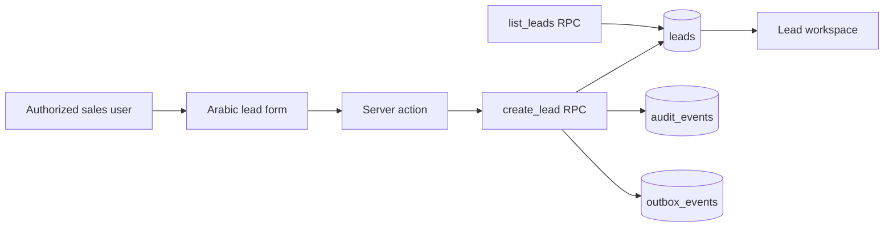

# Lead Registry Safe Foundation Design

## Scope

Implement the first CRM slice required by FR-4 without making an unapproved PII, consent, pricing, merge, or financial-policy decision. A lead is an organization-scoped operational record; it is not a client and it cannot reserve or price inventory.

## Options considered

1. **Full CRM capture now**: contact details, consent, budget, activities, assignment, conversion, and deduplication. This meets the largest surface area quickly but requires field sensitivity, retention, normalization, consent, merge, and access-policy decisions that are not approved.
2. **Safe operational lead registry now (recommended)**: title, source, requested stay range, enumerated lifecycle status, optional active-member assignee, timestamps, idempotency, audit, and outbox. It supports sales intake and later integration while retaining no contact PII or financial amount.
3. **No lead model until all CRM decisions are made**: avoids risk but blocks the sales workflow and safe Sales AI read tooling.

## Decision

Choose option 2. The initial `leads` table stores: `id`, `organization_id`, `title`, `source`, `status`, `requested_check_in`, `requested_check_out`, `assigned_membership_id`, `idempotency_key`, `created_at`, and `updated_at`.

Status is intentionally limited to `new`, `qualified`, `lost`, and `converted`. No user-controlled free-text status is accepted. Requested dates must either both be null or form a half-open valid range. Assignment is constrained to an active membership in the same organization.

## Access and commands

`owner`, `manager`, and `sales_agent` may create leads. `operations`, `accountant`, and `viewer` cannot. Direct browser access to the table is revoked. A security-definer RPC constructs the actor from `auth.uid()`, validates all fields, requires an idempotency key, creates an audit event and an outbox event in the same transaction, and never accepts actor identity from its parameters.

Initial read access is returned only through a narrow list RPC: owners/managers see all records; sales agents see records assigned to them or unassigned records. Operations, accountants, and viewers receive a generic authorization failure. The function returns no PII because none exists in this slice.

## Deliberate exclusions

- phone, email, address, government identifiers, consent records, notes, attachments, and activity text;
- budget/currency/price, quote generation, payment, commission, or settlement data;
- duplicate matching, auto-merge, merge commands, client conversion/linking, and booking creation;
- status changes, re-assignment, deletion, or external messaging.

These exclusions keep the first migration additive and reversible while preserving room for a later PII policy and approval-backed conversion flow.

## Data flow

## Failure handling

Incomplete or invalid ranges, invalid status/source/title, missing idempotency key, unauthorized role, a foreign-tenant assignment attempt, and idempotency-key payload mismatch are rejected. The UI displays a generic Arabic error and does not expose database details or lead existence across organizations.

## Tests and acceptance evidence

- PostgreSQL integration assertions prove RLS/grant denial, same-tenant assignment, foreign-tenant assignment rejection, role denial, idempotency replay, list scoping, audit, and outbox behavior.
- Unit/component tests cover Arabic form payload, validation feedback, pending state, and list rendering.
- E2E proves unauthenticated `/workspace/leads` redirects to sign-in; authenticated test coverage follows once a test session fixture exists.
- Full unit coverage, database tests, E2E, lint, build, dependency audit, and diff check remain release gates.
