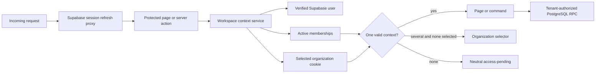

# Production Reliability Remediation Design

## Scope

Remediate the production blockers identified in the 22 July 2026 repository audit without expanding finance, approval, retention, or provider policy. The work covers request-time authentication, Supabase session refresh, explicit organization context, reusable server authorization and error reporting, repeatable form submissions, recoverable outbox leases, and production-like regression tests.

The existing server-owned modular monolith remains the system boundary. Browser writes stay deny-by-default and all tenant-sensitive commands continue to authorize inside PostgreSQL as well as in the server runtime.

## Options considered

1. **Minimal route patches:** mark each protected page dynamic, rotate form keys, and amend the outbox query. This is quick but preserves duplicated membership resolution, inconsistent error handling, and no explicit organization-switch contract.
2. **Centralized production boundary (selected):** introduce one request-time workspace-context service, one Next.js 16 session-refresh proxy, a validated organization-selection cookie, shared operational error reporting, a reusable idempotency-key hook, and an additive outbox recovery migration. This fixes the observed failures while retaining the current architecture.
3. **Backend-for-frontend rewrite:** move every browser operation behind a separate API service. This gives a larger isolation boundary but adds deployment and operational complexity that is not justified by the current defects.

## Decision

Choose option 2. Protected pages must never be prerendered with build-time authentication state. Every workspace request waits for an incoming connection before reading cookies or calling Supabase. A root `src/proxy.ts` refreshes Supabase authentication cookies on relevant application requests using the Next.js 16 proxy convention and excludes static assets.

The proxy refreshes identity only; it does not make tenant authorization decisions. Pages, actions, and PostgreSQL functions continue to authorize independently.

## Workspace and organization context

A shared server-only workspace-context service:

- obtains the verified Supabase user with `auth.getUser()`;
- loads all active memberships and treats query failures as operational failures rather than absent access;
- reads an opaque selected-organization cookie;
- accepts the selection only when it matches one of the verified active memberships;
- automatically selects the sole active membership;
- reports `selection_required` when several active memberships exist and no valid selection is present;
- exposes the trusted membership ID, organization ID, and role to server-owned consumers.

An authenticated organization-selection Server Action accepts an organization ID, checks it against the caller's active memberships, writes a secure `httpOnly`, `sameSite=lax` cookie, and redirects to the workspace. The organization chooser reveals only organizations already readable by the authenticated user. Suspended, removed, foreign, and malformed selections fail closed.

## Request-time rendering and session refresh

Workspace routes call Next.js `connection()` before authentication or tenant data access. The production build acceptance test must reject any workspace response that has prerender/cache markers or a shared-cache TTL. Authenticated requests must reach their organization-scoped page, and unauthenticated requests must still redirect to sign-in.

The refresh proxy creates a Supabase server client from request cookies, calls `auth.getUser()`, and copies any refreshed cookies to both the forwarded request and outgoing response as required by the SSR adapter. Proxy failures do not expose details; they leave authorization to the protected route and emit a sanitized operational event.

## Error handling and observability

Shared workspace helpers never convert dependency failures into `signed_out`, `pending`, or empty data. They distinguish:

- unauthenticated sessions;
- no active membership;
- organization selection required;
- forbidden role;
- unavailable authentication or database dependency.

Operational failures are logged as structured, sanitized server events containing a generated request ID, operation name, safe error code, and outcome. Tokens, cookies, emails, database messages, payload fields, and customer data are excluded. User-facing Arabic messages remain generic. The generated request ID is also passed into database commands that already support `p_request_id`.

## Repeatable idempotent forms

Creation forms use a small client hook that owns the idempotency key. The key remains stable across retries of the same attempted operation, preserving timeout safety. After a confirmed successful action result, the hook generates a new key and resets the form so the user can create a distinct second record without reloading. Invalid, denied, or retry results do not rotate the key.

This behavior applies to booking drafts, availability blocks, clients, properties, property owners, and leads. Component tests prove stable retry keys and key rotation after success.

## Outbox recovery and worker permission

An additive migration replaces `claim_outbox_events` so eligible rows include:

- `pending` and `retry_wait` rows whose `available_at` has arrived; and
- `processing` rows whose `locked_until` is in the past.

Claiming remains ordered and uses `FOR UPDATE SKIP LOCKED`. Reclaimed rows receive the new worker ID and lease, increment attempts once, and clear the prior error code. Active leases cannot be stolen.

The migration introduces a dedicated `voya_outbox_worker` PostgreSQL role when it does not already exist, grants only schema usage and function execution needed to claim events, and does not grant browser roles table access. Completion, retry, and dead-letter state transitions remain out of scope because their retry limits and retention policy are unresolved; production notification delivery must remain disabled until those commands are approved.

## Security boundaries

- The selected organization cookie is a hint validated against current server-read membership on every request, never an authorization source.
- The proxy performs session maintenance, not authorization.
- PostgreSQL RPCs continue deriving the actor from `auth.uid()` and enforcing organization and role.
- Browser roles receive no direct tenant-table write or outbox access.
- Logs contain no secrets, session material, raw provider errors, or customer data.
- All redirects are fixed internal paths; no browser-supplied redirect destination is accepted.

## Tests and acceptance evidence

Development follows red-green-refactor for each behavior:

1. Unit tests for organization-context selection, invalid selections, dependency errors, and sanitized logging.
2. Component tests for consecutive successful form submissions and stable keys across retries.
3. PostgreSQL tests for expired-lease reclamation, active-lease exclusion, concurrent claims, browser denial, and dedicated-worker execution.
4. Production-server E2E tests after `next build` proving protected routes are request-time, unauthenticated redirects work, and a controlled authenticated fixture reaches a tenant-scoped page.
5. Existing coverage, database, E2E, lint, build, dependency audit, and available Trivy/Snyk scans remain release gates.

If an explicit local test database or authenticated fixture is unavailable, implementation may proceed only to the point covered by deterministic local checks; final production readiness remains unverified and must be reported as such.

## Rollout and rollback

Deploy the authentication/rendering changes and additive outbox migration to Preview first. Verify session refresh before and after access-token expiry, organization switching, cache headers, tenant isolation, outbox lease metrics, and sanitized error events. The application rollback is the previous immutable deployment. The database migration is forward-compatible; rollback uses a reviewed follow-up migration rather than destructive history edits.

## Deliberate exclusions

- Finance, tax, commission, settlement, cancellation, approval-execution, and retention policy.
- Outbox completion, retry timing, retry limits, dead-letter retention, or notification-provider selection.
- A separate backend service or general authorization rewrite.
- External production deployment or migration push without a verified dry-run and explicit deployment scope.
