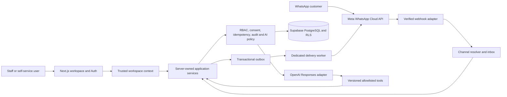

# Voya OS C, Self-Service, AI, and WhatsApp Program Design

**Status:** Approved product direction; awaiting written-spec review
**Date:** 2026-07-30
**Scope:** A phased product program, not one implementation batch.

## Decision

Voya OS will remain a server-owned, Arabic-first modular monolith. It will add:

1. self-service email/password sign-up that creates a private organization and active owner membership for the new user;
2. the approved **Design C** operational experience: premium hospitality visual language, persistent workspace shell, real tenant data, and an equivalent mobile workflow;
3. a governed **AI Agent Center** that lets authorized staff inspect runs, tools, status, safety decisions, and human takeovers; and
4. a tenant-scoped **WhatsApp agent** using a provider adapter, verified inbound webhooks, consent-aware lead capture, and staff handoff.

These are four connected but independently releasable products. They must be specified, planned, implemented, reviewed, and rolled out as separate slices. A broad approval for the program does not authorize a production database migration, external provider setup, outbound customer messaging, or a deployment.

## Product boundaries

### Self-service workspace

Email/password registration creates one new private organization and one active `owner` membership in the same server-owned transaction. It never joins an existing organization, grants a role chosen by the browser, or reveals another organization. Email confirmation may be required by the Supabase launch configuration; after confirmation the user enters their private workspace without an administrator approval step.

Existing invitation and multi-organization selection remain supported. An authenticated user with several memberships must select a validated active organization; a stale, suspended, or foreign selection fails closed.

### Design C workspace

The workspace replaces the current fixture-style public dashboard with a live, tenant-scoped operations view. Desktop uses an RTL-aware fixed right navigation, calm dark-green/ivory/gold surfaces, a clear organization switcher, and a compact global action area. Mobile uses a task-oriented bottom navigation and preserves every supported operational path.

Every workspace surface follows one pattern: page title and purpose, role-safe primary action, search/filter tools where data exists, clear loading/empty/error states, and links back to the persistent application shell. No page may present demonstration records as real operations data. Finance or any other unavailable capability is either absent or explicitly documented as unavailable; it is not a misleading actionable control.

### AI Agent Center

An agent is a bounded server-side orchestration profile, not an autonomous database user. Each visible run records the initiating actor, organization, agent/version, lifecycle status, safe summary, tool calls, policy outcome, cost/latency class, correlation ID, and any handoff/proposal reference. Authorized staff can inspect their permitted runs; owners/managers receive the organization scope. Raw prompts, tokens, secrets, or restricted CRM fields are never exposed merely because a user can view a run.

The first agent set is Sales, Operations, Manager Summary, and WhatsApp. All tools are versioned and allowlisted. AI can read authorized facts and create an explicitly labeled lead or proposal only through reviewed application commands. It cannot confirm bookings, invent pricing, process payments, alter memberships, approve actions, run arbitrary SQL/HTTP, or bypass tenant/RBAC/database controls. Per-agent and per-channel kill switches stop new work without breaking manual workflows.

### WhatsApp agent

Voya uses a server-side provider port with a Meta WhatsApp Business Cloud API adapter as the initial implementation. The web UI, domain services, and agent runtime depend on the port rather than Meta-specific calls.

Inbound webhooks are signature-verified, replay/deduplication protected, rate-limited, persisted as an auditable channel event, and routed only after resolving an enabled tenant channel. The agent may answer approved informational questions, collect the customer’s name, phone, requested dates, guest count, and preferences, and create or update a consent-aware WhatsApp lead through a reviewed command. It can ask clarifying questions and transfer a thread to staff.

The agent must not confirm a booking, quote or negotiate a price, take payment, disclose restricted information, change a membership, approve anything, or send arbitrary proactive messages. Outbound messages are permitted only through a verified channel policy: customer-initiated conversation window or an approved template, recorded consent/opt-out status, and a channel/agent kill switch. A human takeover immediately prevents automated replies until staff release the conversation.

## Architecture and trust boundaries

The trusted context supplies actor, organization, role, locale, session assurance, source channel, and request/correlation IDs. Neither the browser, model, WhatsApp payload, nor provider callback chooses these values. PostgreSQL constraints/RLS/RPC authorization remain the final tenancy boundary.

Sensitive contact fields, consent evidence, WhatsApp conversations, AI traces, and provider references are classified data. They have separate field policy, access checks, audit records, bounded retention, and deletion/anonymization design before collection is enabled. Raw secrets, message content beyond the minimum business record, API tokens, and callback signatures do not enter ordinary logs or AI prompts.

## Program slices and dependencies

| Slice | Deliverable | Depends on | Release boundary |
|---|---|---|---|
| 0 | Release-baseline reconciliation | Current dirty remediation, guarded DB evidence, scanner and authenticated-browser gaps | No new product function; accurately establish current baseline |
| 1 | Self-service identity and organization bootstrap | Current Supabase auth/context boundary | Preview only until bootstrap, abuse controls, and cross-tenant tests pass |
| 2 | Design C app shell and live operational dashboard | Slice 1 identity contract; existing protected reads | Feature flag/preview; no fixture dashboard represented as live data |
| 3 | CRM contact/consent and live agent observability | Slices 1–2; field-level CRM policy | Internal test organization only |
| 4 | WhatsApp inbound, handoff, and draft-lead agent | Slice 3; Meta sandbox/channel configuration; worker lifecycle | Sandbox/canary only, inbound and human-handoff first |
| 5 | Controlled WhatsApp outbound and broader agent tools | Slice 4; approved templates, opt-out, retention, staffing, and operations policy | Tenant-by-tenant canary with kill switch and alerting |

Slice 0 is mandatory before claiming production readiness. Slices 1–5 must not be compressed into one migration or one deployment.

## Data and interface decisions

1. Bootstrap is a dedicated, idempotent server command/function. It creates a profile if absent, a new organization with a server-generated slug, and the initiating active owner membership atomically. It includes rate/abuse controls and an audit event; it is not a browser table write.
2. CRM v2 extends the safe lead registry through additive migrations. It introduces normalized contact methods, consent/opt-out evidence, source channel, message/conversation references, and field-level policy. The existing PII-free lead foundation remains valid and is not retrofitted with uncontrolled free text.
3. The Agent Center persists `ai_runs` and `ai_tool_calls` through server-owned services with immutable event-like state changes. It supports `queued`, `running`, `waiting_for_human`, `completed`, `failed`, `refused`, `cancelled`, and `stopped`; only server policy performs transitions.
4. WhatsApp uses separate tenant-channel, conversation, message-event, handoff, and delivery-attempt models. Provider payloads are deduplicated by tenant/provider event identity. Message events link to leads only after tenant resolution and consent-aware command validation.
5. A worker can claim, complete, retry, dead-letter, and retain external deliveries only after the existing outbox lifecycle policy is designed and tested. Until then, no external delivery path is enabled.

## Documentation reconciliation

The following documents remain authoritative for their security principles but require additive updates or supersession notes during the relevant slice:

| Current document | Keep | Change in this program |
|---|---|---|
| `PRD.md` | tenant isolation, human-controlled AI, RTL, audited commands | Add self-service bootstrap, Design C/live workspace criteria, CRM consent, WhatsApp provider/handoff boundary, and explicit channel policy decisions |
| `ARCHITECTURE.md` | modular monolith, ports/adapters, outbox, RLS | Add identity bootstrap service, agent-control plane, provider adapter/webhook boundary, and worker ownership |
| `DATABASE.md` | tenant keys, RLS, audit, `ai_runs`/tool-call concepts | Add precise channel, consent, conversation, delivery, handoff, retention, and bootstrap invariants in slice-specific schema designs |
| `AI_AGENTS.md` | allowlisted tools, OpenAI adapter, human approval, kill switches | Add Agent Center read model, WhatsApp profile, run visibility/RBAC, and supported handoff states |
| `USER_FLOWS.md` and `PERMISSIONS.md` | role-based workflow and active-membership model | Add sign-up/confirmation, organization bootstrap, agent review, WhatsApp handoff, opt-out, and per-field visibility flows |
| `TEST_PLAN.md` | security-first release gates | Add concrete bootstrap, consent, webhook, replay, AI-run, handoff, opt-out, and outbound-template cases |
| `SECURITY_REVIEW_AUTH_BOUNDARY.md` | server-only configuration and safe redirects | Mark the “platform-provisioned organization only” and “exactly one membership” statements as superseded by validated self-service bootstrap and selection context |
| foundation plans/reviews | their narrow implemented controls | Preserve them as historical evidence; do not rewrite them to claim later work was already verified |

## Required policy decisions before activation

The technical design deliberately does not invent the following. Each is a precondition for the slice that uses it:

- launch countries, privacy basis, consent wording, retention/deletion windows, and legal-hold handling for contact and conversation data;
- Meta Business account ownership, verified sending number, permitted message templates, customer-service window behavior, opt-out wording, quiet hours, and escalation SLA;
- OpenAI model alias, data-processing configuration, per-tenant cost/latency budget, and redacted trace retention;
- self-service abuse controls: confirmation policy, organization naming/slug rules, IP/email rate limits, and support recovery path;
- which staff roles may see contact details, transcripts, agent errors, cost data, or take/release a handoff.

## Acceptance and safety gates

Each slice requires focused unit, integration/database, browser, and independent security-review evidence. The final program cannot be called production-ready until the current release-baseline gates and all enabled-slice gates pass.

- Bootstrap: duplicate/replay safety; one new tenant only; no join to an existing tenant; confirmation/abuse failures; last-owner and multi-membership selection tests.
- Design C: real tenant data, no fixture claims, role-safe navigation, Arabic RTL/English LTR, keyboard/focus/contrast, responsive workflow evidence, and safe error/loading states.
- CRM/Agent Center: cross-tenant and field-level denial, immutable run history, tool schema/authorization failures, stop/takeover behavior, prompt-injection resistance, cost/rate controls, and manual-workflow fallback.
- WhatsApp: signature verification, wrong-tenant and replay denial, idempotent webhook processing, consent/opt-out enforcement, bounded data collection, no unauthorized outbound sends, human handoff, kill switch, outbox failure/retry/dead-letter behavior, and provider sandbox tests.
- Release: migration rehearsal against disposable and preview environments, protected-route cache-header test, token refresh, full lint/build/test suite, dependency audit, Trivy/Snyk evidence, scanner status, operational dashboards/alerts, rollback rehearsal, and final security review.

## Rollout and rollback

All schema changes are additive/expand-contract and deployed to preview before production. Each capability is independently feature-flagged by environment, tenant, agent, and channel. Rollback disables the feature flag and reverts application behavior; database history is forward-fixed with a reviewed migration rather than erased. Disablement of AI or WhatsApp never blocks manual lead, booking, property, or operations workflows.

## Scope boundary

This program does not authorize autonomous booking/finance actions, payments, provider credentials, outbound WhatsApp campaigns, financial/approval policy, a public guest portal, or a microservice rewrite. The first executable specification will cover only Slice 0 and Slice 1; later slices receive their own approved design and plan after their policy prerequisites are supplied.
