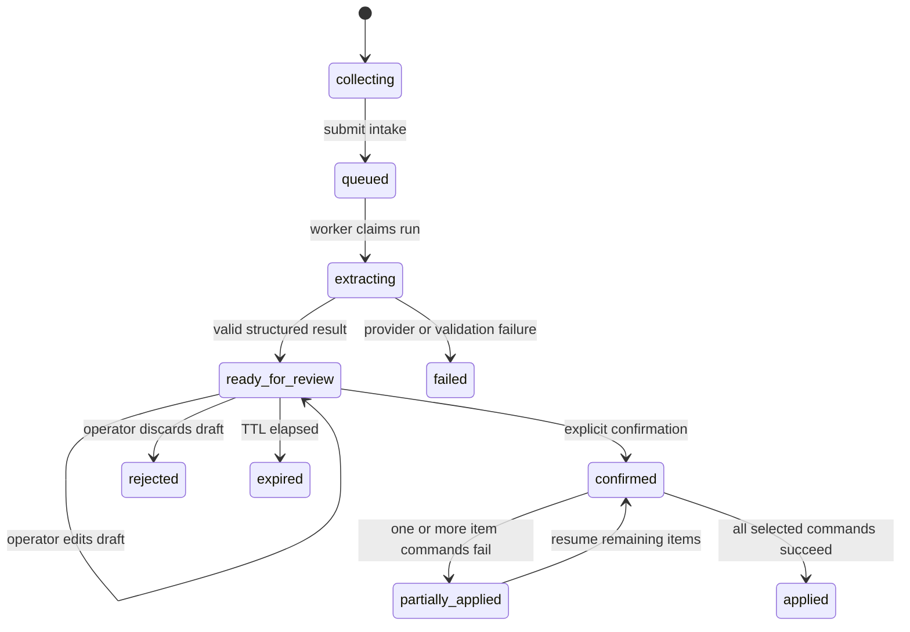

# AI-assisted CRM and inventory data-entry design

**Status:** Proposed for implementation review  
**Date:** 2026-08-22  
**Product boundary:** Voya OS internal workspace only

## Scope

Give an authorized Voya OS operator a governed intake flow where they can type
customer/property details and attach supported images. Gemini extracts a
structured draft, the operator edits and confirms it, and only then do the
existing deterministic CRM and inventory commands write source-of-record data.

The first slice supports:

- client records using the fields already supported by `create_client_v1`;
- property records using the fields already supported by `create_property_v1`;
- private image intake and, after explicit mapping during confirmation, private
  property-image registration through `register_property_image_v1`;
- multiple clients/properties in one draft, with per-record confirmation and
  resumable idempotent execution.

The first slice does not support autonomous writes, booking/payment/finance
actions, client-document retention, automatic duplicate merging, outbound
messaging, or arbitrary model-provided SQL/API/tool calls. A fact with no
matching source-of-record field (for example a property area field if it is not
present in the current schema) remains visible as unresolved and is never
silently placed in an unrelated column.

## Decision

Use a three-stage workflow:

1. **Collect:** create a tenant-scoped intake draft and upload images through a
   bounded authenticated route, not a Next.js Server Action. This avoids the
   existing 1 MB Server Action body limit and keeps raw files in a private
   storage bucket.
2. **Extract:** enqueue a governed `data_entry` AI run. The outbox worker loads
   the draft and private inputs, sends only the approved customer-data class to
   Gemini, validates a strict JSON result, and stores a reviewable draft. The
   model has no write tools and receives no credentials, SQL, actor identity, or
   unrestricted HTTP capability.
3. **Confirm:** render an editable Arabic RTL review surface. The operator
   chooses which records and image mappings to keep, supplies missing required
   fields, and explicitly confirms. The server then calls the existing
   role-checked, idempotent CRM/property/image commands. A partial batch is
   visible and can be resumed safely; it is never reported as all-or-nothing
   success when one item failed.

## Roles and authorization

The data-entry agent is available to `owner`, `manager`, `sales_agent`, and
`operations`, matching the existing operational write surfaces. `accountant`
and `viewer` cannot create or confirm data-entry drafts. The draft and its
inputs are organization-scoped, and non-owner/manager readers can see only
their own drafts, following the existing AI-run visibility rule.

Every server action and route derives the organization and membership from the
verified Supabase session. The browser may submit a draft ID, item selections,
and form values, but never an organization ID, role, actor ID, or source-record
authorization decision. Database RPCs repeat tenant and role checks.

## Draft contract

The persisted extraction payload is bounded JSON with this shape:

```json
{
  "clients": [
    {
      "display_name": "اسم العميل",
      "phone": null,
      "whatsapp": null,
      "email": null,
      "nationality": null,
      "preferred_language": null,
      "notes": null,
      "source_lead_id": null,
      "confidence": "medium",
      "missing_required": []
    }
  ],
  "properties": [
    {
      "code": null,
      "name": null,
      "timezone": null,
      "address": "العنوان المذكور",
      "city": "القاهرة الجديدة",
      "unit_label": null,
      "bedrooms": null,
      "max_guests": null,
      "operational_notes": null,
      "image_input_ids": [],
      "confidence": "medium",
      "missing_required": ["code", "name", "timezone"]
    }
  ],
  "unresolved": [
    { "value": "150 متر", "reason": "لا يوجد حقل مساحة في نموذج العقار الحالي" }
  ],
  "warnings": []
}
```

The actual runtime validates object shape, array limits, string lengths,
enumerations, numeric ranges, UUIDs, MIME types, and image-reference ownership
before the UI can present a confirmable draft. Missing data stays `null`; the
model must not invent codes, names, dates, prices, identities, or status
transitions. The UI labels model-derived values and unresolved facts clearly.

## Data and state model

Add tenant-scoped `ai_data_entry_drafts` and `ai_data_entry_inputs` tables. A
draft binds to one `ai_runs` row and stores the bounded source text, extraction
payload, lifecycle/version, creator, confirmation actor, and expiry. Inputs
store only private bucket/path, MIME, byte size, checksum/reference metadata,
and lifecycle facts; they do not make files public. The new AI run kind is
`data_entry`, and its outbox event is still processed by the existing lease-
owned worker.

Draft states:



Confirmation has a stable idempotency key per draft item and a draft-level
confirmation key. Retries return the original source-record IDs for completed
items. The confirmation path never merges duplicates; existing CRM duplicate
warnings remain visible for human handling.

## File and provider boundary

- The intake bucket is private, size- and MIME-limited to the supported image
  types, and addressed by random server-generated paths under the tenant.
- The upload route enforces authenticated MFA-gated workspace membership,
  content length, MIME, file count, and total draft limits before service-role
  storage writes. It never logs file bytes, names, tokens, or customer text.
- On confirmed property mapping, the server copies an input to the existing
  private `property-images` bucket and registers metadata through the existing
  RPC. Unmapped or expired intake files are deleted by an explicit cleanup
  path; no public URL is created.
- Gemini calls remain behind `GEMINI_ENABLED` and
  `GEMINI_CUSTOMER_DATA_APPROVED`. Preview/test stays synthetic-only. The
  provider receives the source text and selected image bytes as customer data,
  never hidden system secrets.
- Source text and image OCR/content are untrusted data. Prompts explicitly
  instruct Gemini to treat them as content, ignore embedded instructions, and
  return only the schema. Server-side schema validation is authoritative.

## Confirmation write boundary

The confirmation server action performs no direct browser/table DML. It:

1. reloads the draft and verifies status/version, expiry, membership, and role;
2. validates the edited payload against the same domain schema;
3. calls `create_client_v1` and/or `create_property_v1` with stable item keys;
4. copies and registers only explicitly mapped private images;
5. records draft progress and a sanitized audit event without raw source text;
6. revalidates the clients, properties, and AI routes.

Required-field failures are shown before any writes. Provider output is never
treated as proof that a client/property/image was saved. Existing command
audit/outbox behavior remains the source of operational evidence.

## Observability and failure handling

Use request IDs and safe error codes for intake, extraction, validation,
confirmation, storage, and command failures. Logs contain operation, request ID,
draft/run ID where safe, and disposition only; they exclude API keys, cookies,
raw provider messages, image bytes, emails, phone numbers, and full prompts.
Metrics/log events distinguish upload rejection, extraction failure, invalid
model output, expired draft, confirmation partial success, and duplicate-safe
retry. A kill switch disables new extraction while manual CRM/property flows
continue to work.

## Acceptance gates

- No source-record row is created before explicit confirmation.
- Cross-tenant draft/input/confirmation access fails closed in SQL tests.
- Role denial is proven for viewer/accountant and allowed roles are proven.
- Prompt-injection-like source text cannot add tools, alter schema, or bypass
  confirmation.
- Invalid/truncated/oversized model output is rejected without a write.
- Replayed draft/item keys do not duplicate clients, properties, or images.
- Private storage paths and cleanup behavior are proven without public URLs.
- Unit, SQL integration, action/route integration, lint, typecheck, security
  scan, and authenticated browser flow pass on the local checkout.

